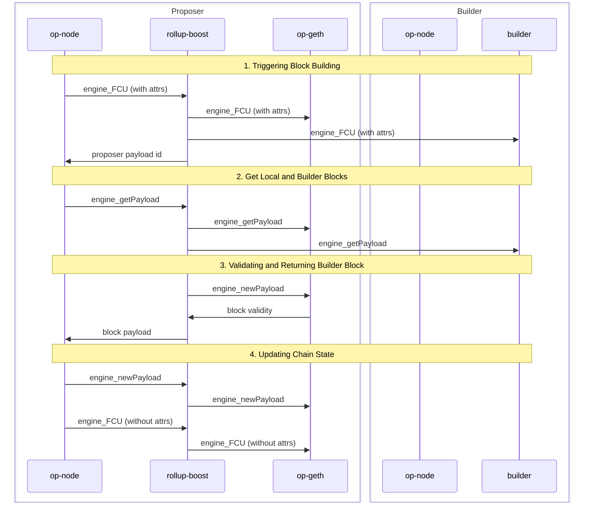

[](https://github.com/flashbots/rollup-boost/actions?query=workflow%3A%22Tests%22)

# Rollup Boost

Rollup Boost is a block builder sidecar for Optimism Stack chains to enable external block production. To read more about the design, check out the [design doc](https://github.com/ethereum-optimism/design-docs/blob/main/protocol/external-block-production.md).

## Usage

Run the rollup-boost server using the following command:

```
cargo run --bin rollup-boost -- [OPTIONS]
```

### Command-line Options

- `--l2-jwt-token <TOKEN>`: JWT token for L2 authentication (required)
- `--l2-jwt-path <PATH>`: Path to the L2 JWT secret file (required if `--l2-jwt-token` is not provided)
- `--l2-url <URL>`: URL of the local L2 execution engine (required)
- `--builder-url <URL>`: URL of the builder execution engine (required)
- `--builder-jwt-token <TOKEN>`: JWT token for builder authentication (required)
- `--builder-jwt-path <PATH>`: Path to the builder JWT secret file (required if `--builder-jwt-token` is not provided)
- `--rpc-host <HOST>`: Host to run the server on (default: 127.0.0.1)
- `--rpc-port <PORT>`: Port to run the server on (default: 8081)
- `--tracing`: Enable tracing (default: false)
- `--log-level <LEVEL>`: Log level (default: info)
- `--log-format <FORMAT>`: Log format (default: text)
- `--metrics`: Enable metrics (default: false)
- `--metrics-host <METRICS_HOST>`: Host to run the metrics server on (default: 127.0.0.1)
- `--debug-host <HOST>`: Host to run the server on (default: 127.0.0.1)
- `--debug-server-port <PORT>`: Port to run the debug server on (default: 5555)

### Environment Variables

You can also set the options using environment variables. See .env.example to use the default values.

### Example

```
cargo run --bin rollup-boost -- --l2-jwt-token your_jwt_token --l2-url http://localhost:8545 --builder-jwt-token your_jwt_token --builder-url http://localhost:8546
```

## Core System Workflow

1. `rollup-boost` receives an `engine_FCU` with the attributes to initiate block building:
   - It relays the call to proposer `op-geth` as usual and multiplexes the call to builder.
   - The FCU call returns the proposer payload id and internally maps the builder payload id to proposer payload id in the case the payload ids are not the same.
2. When `rollup-boost` receives an `engine_getPayload`:
   - It queries proposer `op-geth` for a fallback block.
   - In parallel, it queries builder for a block.
3. Upon receiving the builder block:
   - `rollup-boost` validates the block with proposer `op-geth` using `engine_newPayload`.
   - This validation ensures the block will be valid for proposer `op-geth`, preventing network stalls due to invalid blocks.
   - If the external block is valid, it is returned to the proposer `op-node`. Otherwise, `rollup-boost` will return the fallback block.
4. The proposer `op-node` sends a `engine_newPayload` request to `rollup-boost` and another `engine_FCU` without attributes to update chain state.
   - `rollup-boost` just relays the calls to proposer `op-geth`.
   - Note that since we already called `engine_newPayload` on the proposer `op-geth` in the previous step, the block should be cached and add minimal latency.
   - The builder `op-node` will receive blocks via p2p gossip and keep the builder node in sync via the engine api.



## RPC Calls

By default, `rollup-boost` will proxy all RPC calls from the proposer `op-node` to its local `op-geth` node. These are the list of RPC calls that are proxied to both the proposer and the builder execution engines:

- `engine_forkchoiceUpdatedV3`: this call is only multiplexed to the builder if the call contains payload attributes and the no_tx_pool attribute is false.
- `engine_getPayloadV3`: this is used to get the builder block.
- `miner_*`: this allows the builder to be aware of changes in effective gas price, extra data, and [DA throttling requests](https://docs.optimism.io/builders/chain-operators/configuration/batcher) from the batcher.
- `eth_sendRawTransaction*`: this forwards transactions the proposer receives to the builder for block building. This call may not come from the proposer `op-node`, but directly from the rollup's rpc engine.

## Debug API

The Debug API is a JSON-RPC API that can be used to configure rollup-boost's execution mode. The execution mode determines how rollup-boost makes requests to the builder:

- `enabled`: The builder receives all the engine API calls from rollup-boost.
- `dry-run`: The builder receives all the engine API calls from rollup-boost except for the get payload request.
- `disabled`: The builder does not receive any engine API calls from rollup-boost. This allows rollup-boost to stop sending requests to the builder during runtime without needing a restart.

By default, the debug server runs on port 5555.

### Specification

The debug API implements the following methods:

#### `debug_setExecutionMode`

Sets the execution mode of rollup-boost.

**Params**

- execution_mode: The new execution mode (available options 'dry_run', 'enabled' or 'disabled').

**Returns**

- `execution_mode`: The new execution mode.

**Example**

To set dry run mode:

```bash
curl -X POST -H "Content-Type: application/json" --data '{
    "jsonrpc": "2.0",
    "id": 1,
    "method": "debug_setExecutionMode",
    "params": [{"execution_mode":"dry_run"}]
}' http://localhost:5555
```

To disable rollup-boost calls to the builder:

```bash
curl -X POST -H "Content-Type: application/json" --data '{
    "jsonrpc": "2.0",
    "id": 1,
    "method": "debug_setExecutionMode",
    "params": [{"execution_mode":"disabled"}]
}' http://localhost:5555
```

#### `debug_getExecutionMode`

Gets the current execution mode of rollup-boost.

**Params**

None

**Returns**

- `execution_mode`: The current execution mode.

**Example**

```bash
curl -X POST -H "Content-Type: application/json" --data '{
    "jsonrpc": "2.0",
    "id": 1,
    "method": "debug_getExecutionMode",
    "params": []
}' http://localhost:5555
```

### Debug Command

`rollup-boost` also includes a debug command to interact with the debug API from rollup-boost.

This is useful for testing interactions with external block builders in a production environment without jeopardizing OP stack liveness, especially for network upgrades.

### Usage

To run rollup-boost in debug mode with a specific execution mode, you can use the following command:

```
rollup-boost debug set-execution-mode [enabled|dry-run|disabled]
```

## Maintainers

- [@avalonche](https://github.com/avalonche)
- [@ferranbt](https://github.com/ferranbt)
- [@0xOsiris](https://github.com/0xOsiris)
- [@0xKitsune](https://github.com/0xKitsune)
- [Eric Woolsey](https://github.com/0xForerunner)

## License

The code in this project is free software under the [MIT License](/LICENSE).

---

Made with ☀️ by the ⚡🤖 collective.

🎨 For Rollup Boost brand guidelines and to download brand assets, [click here](https://desert-shelf-a90.notion.site/Rollup-Boost-Brand-Guide-1c08490ae44f80ecaafee5975f71228f).
