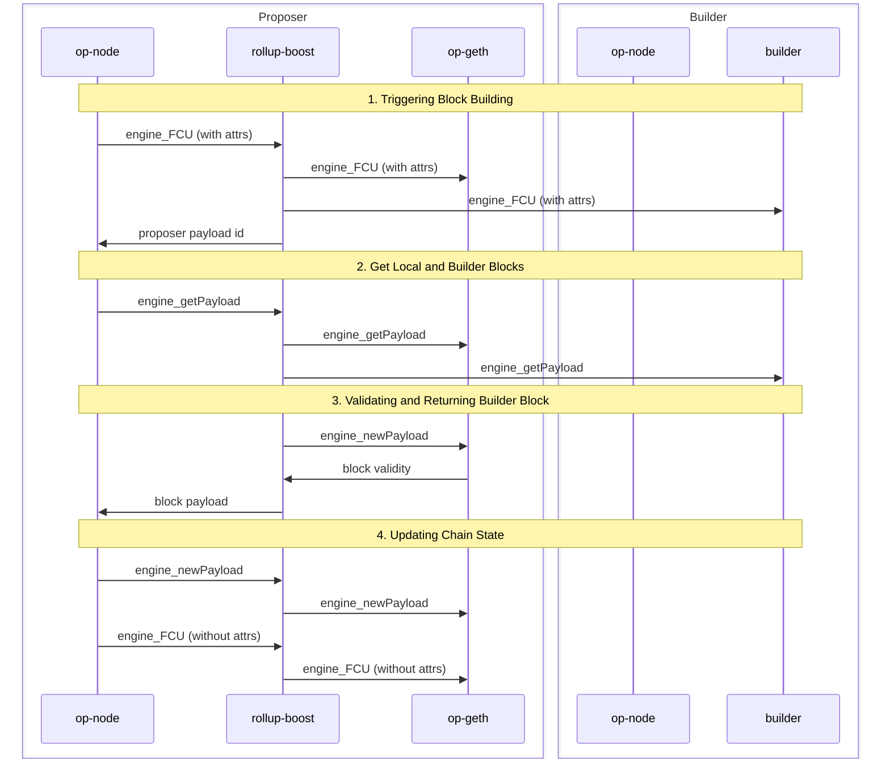

# Rollup Boost

This is an implementation the block builder sidecar for Optimism Stack to enable external block production. To read more about the design, check out the [design doc](https://github.com/ethereum-optimism/design-docs/blob/main/protocol/external-block-production.md).

## Usage

Run the rollup-boost server using the following command:

```
cargo run -- [OPTIONS]
```

### Command-line Options

- `--jwt-token <TOKEN>`: JWT token for authentication (required)
- `--jwt-path <PATH>`: Path to the JWT secret file (required if `--jwt-token` is not provided)
- `--l2-url <URL>`: URL of the local L2 execution engine (required)
- `--builder-url <URL>`: URL of the builder execution engine (required)
- `--builder-jwt-token <TOKEN>`: JWT token for builder authentication. defaults to the value of `--jwt-token` if not provided
- `--builder-jwt-path <PATH>`: Path to the builder JWT secret file.
- `--rpc-host <HOST>`: Host to run the server on (default: 0.0.0.0)
- `--rpc-port <PORT>`: Port to run the server on (default: 8081)
- `--tracing`: Enable tracing (default: false)
- `--log-level <LEVEL>`: Log level (default: info)
- `--metrics`: Enable metrics (default: false)
- `--boost-sync`: Enable syncing the builder with the proposer op-node (default: false)

### Environment Variables

You can also set the options using environment variables. See .env.example to use the default values.

### Example

```
cargo run --jwt-token your_jwt_token --l2-url http://localhost:8551 --builder-url http://localhost:8546
```

## Core System Workflow

1. `rollup-boost` receives an `engine_FCU` with the attributes to initiate block building:
    - It relays the call to proposer `op-geth` as usual and multiplexes the call to builder.
    - The FCU call returns the proposer payload id and internally maps the builder payload id to proposer payload id in the case the payload ids are not the same.
2. When `rollup-boost` receives an `engine_getPayload`:
    - It queries proposer `op-geth` for a fallback block.
    - In parallel, it queries builder for a block.
3. Upon receiving the builder block:
    - `rollup-boost` validates the block with proposer `op-geth` using `engine_newPayload`.
    - This validation ensures the block will be valid for proposer `op-geth`, preventing network stalls due to invalid blocks.
    - If the external block is valid, it is returned to the proposer `op-node`. Otherwise, `rollup-boost` will return the fallback block.
4. The proposer `op-node` sends a `engine_newPayload` request to `rollup-boost` and another `engine_FCU` without attributes to update chain state.
    - `rollup-boost` just relays the calls to proposer `op-geth`.
    - Note that since we already called `engine_newPayload` on the proposer `op-geth` in the previous step, the block should be cached and add minimal latency.
    - The builder `op-node` will receive blocks via p2p gossip and keep the builder node in sync via the engine api.



## RPC Calls

By default, `rollup-boost` will proxy all RPC calls from the proposer `op-node` to its local `op-geth` node. These are the list of RPC calls that are proxied to both the proposer and the builder execution engines:

- `engine_forkchoiceUpdatedV3`: this call is only multiplexed to the builder if the call contains payload attributes and the no_tx_pool attribute is false.
- `engine_getPayloadV3`: this is used to get the builder block.
- `miner_*`: this allows the builder to be aware of changes in effective gas price, extra data, and [DA throttling requests](https://docs.optimism.io/builders/chain-operators/configuration/batcher) from the batcher.
- `eth_sendRawTransaction*`: this forwards transactions the proposer receives to the builder for block building. This call may not come from the proposer `op-node`, but directly from the rollup's rpc engine.

### Boost Sync

`rollup-boost` will sync the builder with the proposer `op-node` if the `--boost-sync` flag is set. After the builder is synced, boost sync improves the performance of keeping the builder in sync by removing the need to receive chain updates via p2p with the builder `op-node`. This entails additional engine api calls that are multiplexed to the builder from rollup-boost:

- `engine_forkchoiceUpdatedV3`: this call will be multiplexed to the builder regardless of whether the call contains payload attributes or not.
- `engine_newPayloadV3`: ensures the builder has the latest block if the local payload was used.

## Observability

To check if the rollup-boost server is running, you can check the health endpoint:

```
curl http://localhost:8081/healthz
```

### Metrics

To enable metrics, you can set the `--metrics` flag. This will start a metrics server which will run on port 9090 by default. To see the list of metrics, you can checkout [metrics.rs](./src/metrics.rs) and ping the metrics endpoint:

```
curl http://localhost:9090/metrics
```

To check that rollup-boost is sending requests to get blocks from the builder, you can check the `builder_get_payload_v3` metric which is incremented when a `engine_getPayloadV3` call is proxied to the builder.

Additionally, execution engines such as op-rbuilder has rpc metrics exposed to check if `engine_getPayloadV3` requests have been received. To check if the builder blocks are landing on-chain, the builder can be configured to include a builder transaction in the block, which is captured as part of the builder metrics. To see more details about obserability in the op-builder, you can check op-rbuilder's [README](https://github.com/flashbots/rbuilder/tree/develop/crates/op-rbuilder).

### Tracing

Tracing is enabled by setting the `--tracing` flag. This will start exporting traces to the otlp endpoint specified in the `--otlp-endpoint` flag. This endpoint is set to `http://localhost:4317` by default.

Traces use the payload id to track the block building lifecycle. A distributed tracing system such as [Jaeger](https://www.jaegertracing.io/) can be used to visualize when the proposer triggers block building via `engine_forkchoiceUpdatedV3` and retrieve the block with `engine_getPayloadV3`.

## License
The code in this project is free software under the [MIT License](/LICENSE).

---

Made with ☀️ by the ⚡🤖 collective.
