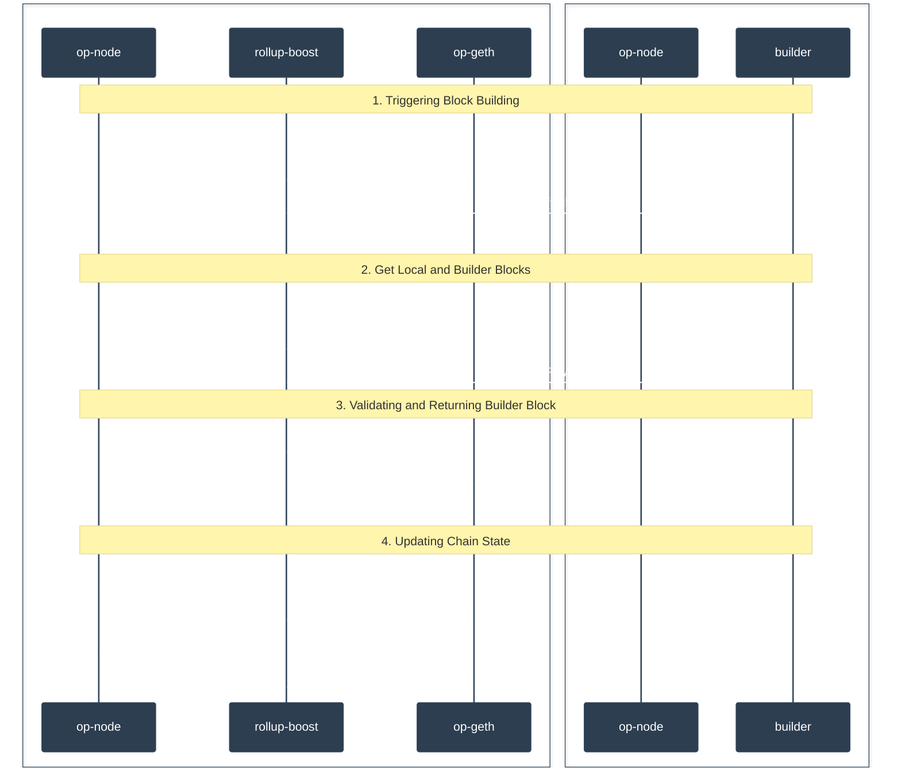

# Architecture Overview

Rollup Boost modifies the workflow of the Engine API to enable block building and flashblocks. It uses the JWT token in the Engine API as authentication for the builder and multiplexes the RPC calls to the builder to source external blocks.

## Core System Workflow

1. `rollup-boost` receives an `engine_FCU` with the attributes to initiate block building:
   - It relays the call to proposer `op-geth` as usual and multiplexes the call to builder.
   - The FCU call returns the proposer payload id and internally maps the builder payload id to proposer payload id in the case the payload ids are not the same.
2. When `rollup-boost` receives an `engine_getPayload`:
   - It queries proposer `op-geth` for a fallback block.
   - In parallel, it queries builder for a block.
3. Upon receiving the builder block:
   - `rollup-boost` validates the block with proposer `op-geth` using `engine_newPayload`.
   - This validation ensures the block will be valid for proposer `op-geth`, preventing network stalls due to invalid blocks.
   - If the external block is valid, it is returned to the proposer `op-node`. Otherwise, `rollup-boost` will return the fallback block.
4. The proposer `op-node` sends a `engine_newPayload` request to `rollup-boost` and another `engine_FCU` without attributes to update chain state.
   - `rollup-boost` just relays the calls to proposer `op-geth`.
   - Note that since we already called `engine_newPayload` on the proposer `op-geth` in the previous step, the block should be cached and add minimal latency.
   - The builder `op-node` will receive blocks via p2p gossip and keep the builder node in sync via the engine api.

## RPC Calls

By default, `rollup-boost` will proxy all RPC calls from the proposer `op-node` to its local `op-geth` node. These are the list of RPC calls that are proxied to both the proposer and the builder execution engines:

- `engine_forkchoiceUpdated`: this call is only multiplexed to the builder if the call contains payload attributes and the no_tx_pool attribute is false.
- `engine_getPayload`: this is used to get the builder block.
- `miner_*`: this allows the builder to be aware of changes in effective gas price, extra data, and [DA throttling requests](https://docs.optimism.io/builders/chain-operators/configuration/batcher) from the batcher.
- `eth_sendRawTransaction*`: this forwards transactions the proposer receives to the builder for block building. This call may not come from the proposer `op-node`, but directly from the rollup's rpc engine.

### Boost Sync

`rollup-boost` will use boost sync by default to sync directly with the proposer `op-node` via the Engine API. Boost sync improves the performance of keeping the builder in sync with the tip of the chain by removing the need to receive chain updates via p2p from the builder `op-node` once the builder is synced. This entails additional engine api calls that are multiplexed to the builder from rollup-boost:

- `engine_forkchoiceUpdated`: this call will be multiplexed to the builder regardless of whether the call contains payload attributes or not.
- `engine_newPayload`: ensures the builder has the latest block if the local payload was used.

## Reorgs 

Rollup-boost remains unaffected by blockchain reorganizations due to its stateless design as a pure proxy layer between the consensus layer (op-node) and execution engines. 

When reorgs impact the sequencing epoch derivation or cause drift in the L2 chain state, rollup-boost simply proxies all Engine API calls—including fork choice updates reflecting the new canonical chain and payload requests for reorg recovery—directly to both the builder and local execution client without maintaining any state about the reorganization. The actual reorg handling, including re-deriving the correct L2 blocks from the updated sequencing windows and managing any resulting drift, is performed by the underlying execution engines (e.g op-geth, op-reth) which receive these reorg signals through the standard Engine API methods that rollup-boost forwards.