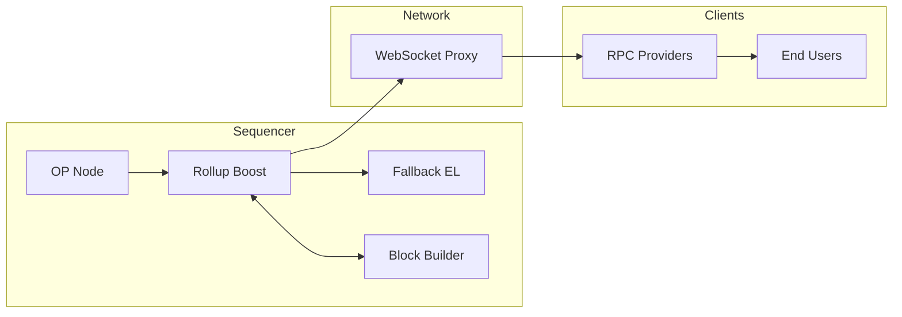

# Flashblocks

Flashblocks is a rollup-boost module that enables fast confirmation times by breaking down block construction into smaller, incremental sections. This feature allows for pre-confirmations and improved user experience through faster block finalization.

## Architecture

The Flashblocks setup consists of three main components:

- **rollup-boost**: The main service with Flashblocks enabled
- **op-rbuilder**: A builder with Flashblocks support
- **op-reth**: A fallback builder (standard EL node)

It utilizes WebSockets to stream Flashblocks from the builder to rollup-boost to minimize the latency between the Flashblocks and the sequencer. 

### Flashblocks Workflow

1. **WebSocket Communication**: Flashblocks utilizes WebSockets to stream Flashblocks from the builder to rollup-boost once it's constructed to minimize the latency between the Flashblocks and the sequencer. 
2. **WebSocket Proxy**: rollup-boost caches these Flashblocks and streams them to a WebSocket proxy. The proxy then fans out the Flashblocks to downstream RPC providers.
3. **RPC Overlay**: Once RPC providers receive these Flashblocks from the proxy, clients need to run a modified node that supports serving RPC requests with the Flashblocks preconfirmation state.
4. **Full Block**: At the end of the slot, the proposer requests a full block from rollup-boost. If rollup-boost does not have the Flashblocks cached due to a lost connection, it will fall back to the getPayload call to both the local execution client and the builder.

See the [specs](https://github.com/flashbots/rollup-boost/blob/main/specs/flashblocks.md) for the full design details for Flashblocks.