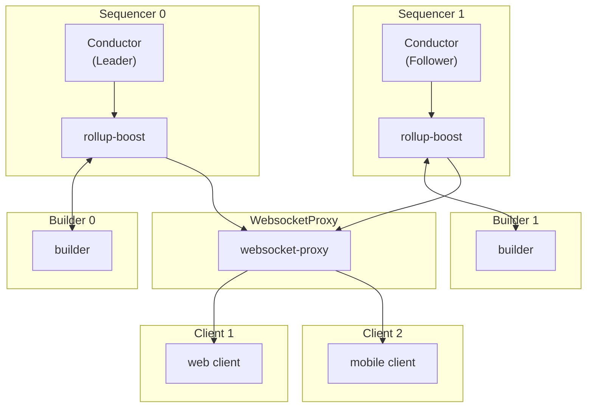

# Table of Contents

- [Context/Scope](#contextscope)
  - [Goals](#goals)
  - [Non Goals](#non-goals)
- [Design](#design)
  - [Overview](#overview)
  - [Failure Cases](#failure-cases)
  - [Alternative Approaches](#alternative-approaches)

# Context/Scope

This document is an extension of the existing [rollup-boost-ha.md](https://github.com/flashbots/rollup-boost/blob/main/docs/rollup-boost-ha.md) that focuses on designing an architecture that will be able to serve a large number of WebSocket-connected clients subscribed to receive flashblocks. The current HA setup has multiple instances of rollup-boost that are each connected to their own builder. The active rollup-boost instance will receive flashblocks from its builder and sends to the reverse-proxy. The reverse-proxy then serves this data to connected clients. This document specifically looks to harden the communication to reverse-proxy and scale the service to support a large number of client connections.



## Goals

- Explore a queue solution to harden communication between the multiple rollup-boost instances and the reverse-proxy
- Allow the reverse-proxy to horizontally scale with incoming connection requests

## Non Goals
- Decentralization of the sequencer/builder/websocket-proxy
- Monitoring / alerting strategies. This can be specified in a separate document once an architecture is solidified.

<br>

# Design

## Overview

The following design introduces two components to the existing HA setup: 

A queue that will replace websockets for communcation between `rollup-boost` <-> `reverse-proxy` The current approach has a single `websocket-proxy` that is a single point of failure. As the number of client connections increase, scaling up the networking/compute of the single instance also becomes a limitation. Without a message queue, each rollup-boost instance would also need to manage connections to many `reverse-proxy` as they may be scaled up/down.

A number of queue options are viable (RabbitMQ, Redis Streams, Kafka) and come with their own HA tradeoffs. After reaching alignment on the queue approach, we can continue the discussion on which is the most appropriate for the use case. We value message delivery guarantees and operational simplicity over throughput (as we expect ~5 messages/second, assuming 200ms flashblocks).

A load balancer will handle incoming websocket connection requests between multiple instances of `reverse-proxy`. My recommendation is to use HAProxy as it is specifically optimized for websockets and comes with out-of-the-box solutions for rate limiting. This is crucial as DOS attacks by creating a large number of clients is a simple attack vector. HAProxy checks the liveness of `reverse-proxy` every 2 seconds, marks the instance as unhealthy if it fails the health check, and will close all client connections to the instance. The client is able to reconnect after a few seconds to a new instance.

It is important to note that all components besides the builder are expected to be in the same infrastructure. This greatly simplifies connectivity between `rollup-boost` <-> `message queue` and `message queue` <-> `websocket-proxy` without any additional authentication. Clients will connect to the `websocket-proxy` through the load balance which can also be put behind additional DOS solutions like Cloudflare. 

```mermaid
graph TB
    %% Top row: Sequencers and Builders
    subgraph S1["Sequencer 1"]
        Conductor1["Conductor<br/>(Follower)"]
        RollupBoost1[rollup-boost]
        
        Conductor1 --> RollupBoost1
    end
    
    subgraph S0["Sequencer 0"]
        Conductor0["Conductor<br/>(Leader)"]
        RollupBoost0[rollup-boost]
        
        Conductor0 --> RollupBoost0
    end
    
    subgraph B1["Builder 1"]
        Builder1[builder]
    end
    
    subgraph B0["Builder 0"]
        Builder0[builder]
    end
    
    %% Second row: Queue
    subgraph Q["Queue"]
        Queue[message queue]
    end
    
    %% Third row: WebsocketProxy instances
    subgraph WP1["WebsocketProxy 1"]
        WebsocketProxy1[websocket-proxy]
    end
    
    subgraph WP2["WebsocketProxy 2"]
        WebsocketProxy2[websocket-proxy]
    end
    
    %% Fourth row: Load Balancer
    subgraph LB["Load Balancer"]
        LoadBalancer[load balancer]
    end
    
    %% Fifth row: Clients
    subgraph C1["Client 1"]
        Client1[web client]
    end
    
    subgraph C2["Client 2"]
        Client2[mobile client]
    end
    
    %% Sequencer to Builder connections
    RollupBoost1 <-->  Builder1
    RollupBoost0 <-->  Builder0
    
    %% Rollup-boost to Queue connections
    RollupBoost1 --> Queue
    RollupBoost0 --> Queue
    
    %% Queue to WebsocketProxy connections
    Queue --> WebsocketProxy1
    Queue --> WebsocketProxy2
    
    %% WebsocketProxy to Load Balancer connections
    WebsocketProxy1 --> LoadBalancer
    WebsocketProxy2 --> LoadBalancer
    
    %% Load Balancer to Clients connections
    LoadBalancer --> Client1
    LoadBalancer --> Client2
  ```

## Failure Scenarios

| Failure Scenario | Category | Scenario and Solution |
| --- | --- | --- |
| Websocket Proxy instance does down | Websocket Proxy Failure | HAProxy marks the instance as unhealthy and will close all client connections to the instance. The client is able to reconnect after a few seconds to a new instance. Expected downtime ~30s  |
| Active HAProxy goes down | Load Balancer Failure | HAProxy can be run with a active/passive setup with Keepalived where all connections will be passed to the passive node that will be marked as active. Expected downtime ~15s |
| Message queue node goes down | Message Queue Failure | TODO: Based on selected message queue solution. We would pick a solution where there is no loss of messages |

## Alternative Approaches
 - Send flashblocks directly from builder to message queue

We need rollup boost to validate the flashblock via its local execution client before serving to clients. 