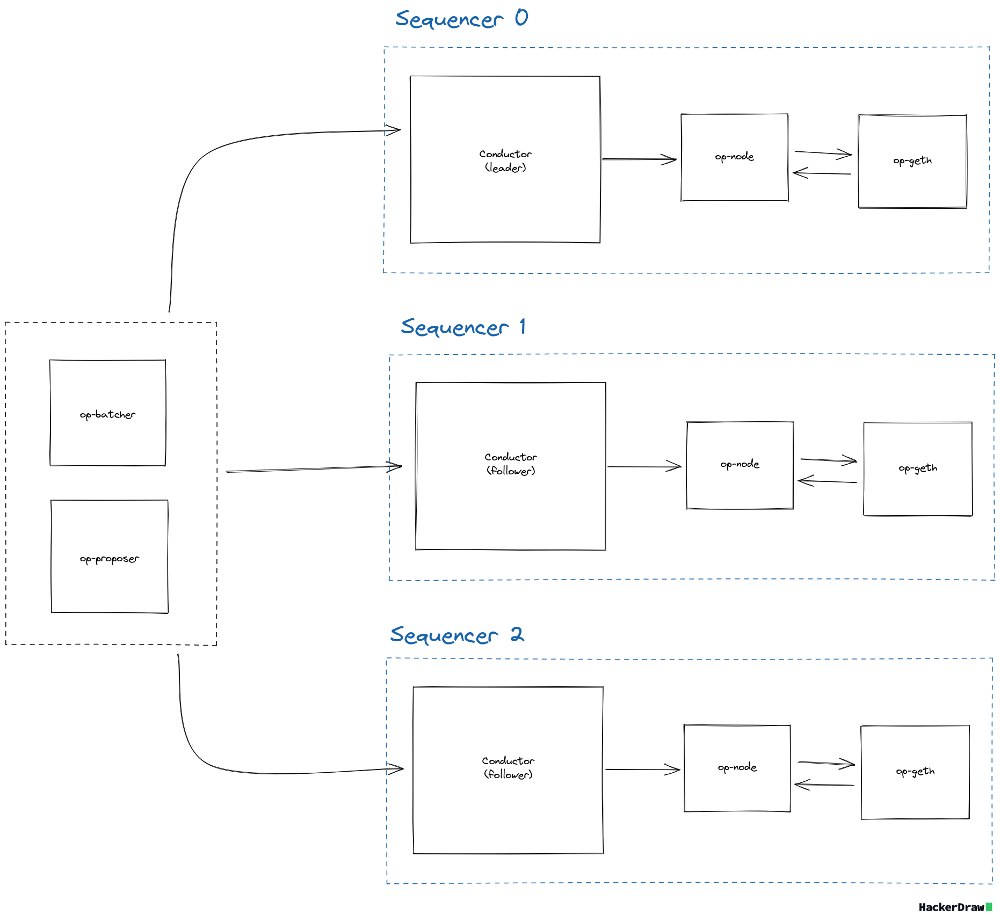
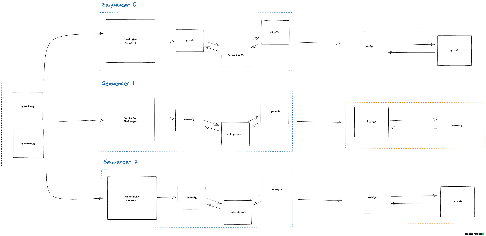
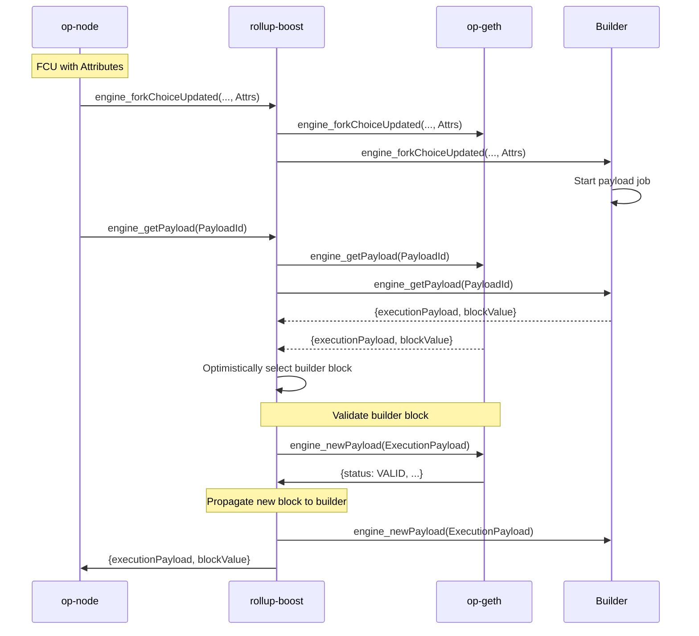

# Table of Contents

- [Context/Scope](#contextscope)
  - [Goals](#goals)
  - [Non Goals](#non-goals)
- [Design](#design)
  - [Overview](#overview)
  - [Health Checks](#health-checks)
  - [Execution Mode](#execution-mode)
  - [Debug API](#debug-api)
  - [Failure Scenarios](#failure-scenarios)

# Context/Scope

The current OP Stack sequencer HA design relies on `op-conductor` to manage a cluster of sequencers. Each node runs a local conductor instance, and the cluster forms a Raft quorum to elect a single leader responsible for block production. The conductor continuously monitors the health of the sequencer, electing a new leader when the current leader is unhealthy. The leader notifies it's local sequencer to run in sequencing mode, allowing `op-node` to send FCUs with payload attributes signaling the execution client to build a new payload. All follower instances are run without sequencer mode enabled, ensuring that only one sequencer is producing blocks at a time.

<p align="center">
  
</p>

With the introduction of `rollup-boost`, an additional component is introduced that sits in-between `op-node` and `op-geth` that forwards Engine API requests to an external builder.

This design document outlines the architecture, components, and failure strategies required for HA `rollup-boost`. The proposed design prioritizes fault tolerance, liveliness, horizontal scalability, and minimal failover time while maintaining upstream compatibility with `op-conductor`.

## Goals

- Explore HA designs for `rollup-boost` prioritizing liveliness, fault tolerance and horizontal scalability for external block builders.
- Maintain compatibility with `op-conductor` and its sequencing assumptions.

## Non Goals

- Define how Flashblocks are handled, consumed or streamed to the network.
- Define how pending transactions are relayed/peered across the builders/sequencer execution clients.
- Monitoring / alerting strategies. This can be specified in a separate document once an architecture is solidified.

<br>

# Design

## Overview

The following design builds on the existing HA sequencer setup by introducing a `rollup-boost` instance between each `op-node` and its local `op-geth` instance. In this model, each `rollup-boost` is paired with a single external builder and default execution client. When `op-node` sends an FCU containing payload attributes, `rollup-boost` forwards the request to both the default execution client and its paired builder.

Upon receiving a `get_payload` request from `op-node`, `rollup-boost` forwards the call to both the builder and default execution client. If the builder returns a payload, it is validated via a `new_payload` call to the sequencer's local execution client. If the builder payload is invalid or unavailable, `rollup-boost` falls back to the local execution client’s payload.



In the event of sequencer failover, `op-conductor` elects a new leader, promoting a different `op-node` along with its associated `rollup-boost` and builder instance. Since each builder is isolated and only serves requests from its local `rollup-boost`, no coordination between builders is required. This separation mirrors the existing HA model of the OP Stack, extending it to external block production.

This approach is operationally simple and relies on the same liveness and fault tolerance guarantees already provided by the OP Stack's sequencer HA setup. Note that `rollup-boost` does not currently feature a block selection policy and will optimistically select the builder's block for validation. In the event of a bug in the builder, it is possible valid, but undesirable blocks (eg. empty blocks) are produced. Without a block selection policy, `rollup-boost` will prefer the builder's block over the default execution client. If the builder produces undesirable but valid blocks, operators must either manually disable external block production via the `rollup-boost` debug API, disable the block builder directly (causing health checks to fail), or manually select a new sequencer leader. Proper monitoring alerting can help mitigate this but further designs should be explored to introduce safeguards into rollup-boost directly rather than relying on the builder implementation being correct.

Below is a happy path sequence diagram illustrating how `rollup-boost` facilitates payload construction/validation:



<br>

## Health Checks

In high availability deployments, `op-conductor` must assess the full health of the block production path. Rollup Boost will expose a composite `/healthz` endpoint to report on both builder synchronization and payload production status. These checks allow `op-conductor` to detect degraded block building conditions and make informed leadership decisions.

Rollup Boost will continuously monitors two independent conditions to inform the health of the builder and the default execution client:

- **Builder Synchronization**:  
  A background task periodically queries the builder’s latest unsafe block via `engine_getBlockByNumber`. The task compares the timestamp of the returned block to the local system time. If the difference exceeds a configured maximum unsafe interval (`max_unsafe_interval`), the builder is considered out of sync. Failure to fetch a block from the builder or detection of an outdated block timestamp results in the health status being downgraded to Partial. If the builder is responsive and the block timestamp is within the acceptable interval, the builder is considered synchronized and healthy.
- **Payload Production**:  
  During each `get_payload` request, Rollup Boost will verify payload availability from both the builder and the execution client. If the builder fails to deliver a payload, Rollup Boost will report partial health. If the execution client fails to deliver a payload, Rollup Boost will report unhealthy.

<br>

| Condition | Health Status |
|:----------|:--------------|
| Builder is synced and both execution client and builder return payloads | `200 OK` (Healthy) |
| Builder is out of sync| `206 Partial Content` (Partially Healthy) |
| Builder fails to return payload on `get_payload` request | `206 Partial Content` (Partially Healthy) |
| Execution client fails to return payload on `get_payload` request | `503 Service Unavailable` (Unhealthy) |

`op-conductor` should query the `/healthz` endpoint exposed by Rollup Boost in addition to the existing execution client health checks. Health should be interpreted as follows:

- `200 OK` (Healthy): The node is fully healthy and eligible for leadership.
- `206 Partial Content` (Partially Healthy): The node is degraded but may be considered for leadership if no fully healthy candidates are available.
- `503 Service Unavailable` (Unhealthy): The node is unhealthy and must be excluded from leadership.

During normal operation and leadership transfers, `op-conductor` should prioritize candidates in the following order:

1. Prefer nodes reporting `200 OK`.
2. If no fully healthy nodes are available, select from nodes reporting `206 Partial Content`.
3. Nodes reporting `503 Service Unavailable` must not be selected as leader.

Rollup Boost instances that are not actively sequencing rely exclusively on the builder sync check to report health, as they are not producing blocks. This behavior mirrors the existing `op-conductor` health checks for inactive sequencers and ensures readiness during failover without compromising network liveness guarantees.

Note that in the case where the builder is unhealthy, `rollup-boost` should bypass forwarding block production requests to the builder entirely and immediately use the default execution client for payload construction. This avoids introducing unnecessary latency to wait for the builder response to timeout.

When builder health is restored, normal request forwarding and payload selection behavior will resume.

<br>

## Execution mode

`ExecutionMode` is a configuration setting that controls how `rollup-boost` interacts with the external builder during block production. Execution mode can be set either at startup via CLI flags or dynamically modified at runtime through the [Debug API](#debug-api).
Operators can use `ExecutionMode` to selectively forward or bypass builder interactions, enabling dry runs during deployments or fully disabling external block production during emergencies.

The available execution modes are:

- `Enabled`
  - `rollup-boost` forwards all Engine API requests to both the builder and default execution client.
  - Optimistically selects the builder’s payload for validation and block publication.
  - Falls back to the local execution client *only* if the builder fails to produce a payload or the payload is invalid.
  - Default setting for normal external block production.

- `DryRun`  
  - `rollup-boost` forwards all Engine API requests to both the builder and default execution client.
  - Builder payloads are validated with the local execution client but the default execution client block will always be returned to `op-node` to propagate to the network.
  - Useful during deployments, dry runs, or to validate builder behavior without publishing builder blocks to the network.

- `Disabled`
  - `rollup-boost` does not forward any Engine API requests to the builder.
  - Block construction is handled exclusively by the default execution client.
  - Useful as an emergency shutoff switch in the case of critical failures/emergencies.

```rust
pub enum ExecutionMode {
    /// Forward Engine API requests to the builder, validate builder payloads and propagate to the network 
    Enabled,
    /// Forward Engine API requests to the builder, validate builder payloads but
    /// fallback to default execution payload
    DryRun,
    // Do not forward Engine API requests to the builder 
    Disabled,
}
```

<br>

## Debug API

`rollup-boost` exposes a Debug API that allows operators to inspect and modify the current execution mode at runtime without restarting the service. This provides flexibility to dynamically enable, disable, or dry-run external block production based on builder behavior or network conditions. The Debug API is served over HTTP using JSON RPC and consists of the following endpoints:

### `debug_setExecutionMode`

Sets the current execution mode for `rollup-boost`.

**Request**:

```
{
  "method": "debug_setExecutionMode",
  "params": [ "enabled" | "dry_run" | "disabled" ],
  "id": 1,
  "jsonrpc": "2.0"
}
```

**Response**:

```
{
  "result": null,
  "id": 1,
  "jsonrpc": "2.0"
}
```

### `debug_getExecutionMode`

Retrieves the current execution mode.

**Request**:

```
{
  "method": "debug_getExecutionMode",
  "params": [],
  "id": 1,
  "jsonrpc": "2.0"
}
```

**Response:**

```
{
  "result": "enabled" | "dry_run" | "disabled",
  "id": 1,
  "jsonrpc": "2.0"
}
```

<br>

## Failure Scenarios

Below is a high level summary of how each failure scenario is handled. All existing failure modes assumed by upstream `op-conductor` are maintained:

| Failure Scenario | Category | Scenario and Solution |
| --- | --- | --- |
| Leader Sequencer Fails | Sequencer Failure | Conductor will detect sequencer failure and start to transfer leadership to another node, which will start sequencing instead. `op-conductor` will prioritize electing a leader with full health however if there are no sequencers that are fully healthy, a sequencer with partial health will be selected. Once the originally failed sequencer is back online, it will join the sequencer set as a follower. |
| Leader `rollup-boost` Unhealthy | Rollup Boost Failure | Leader sequencer `rollup-boost` becomes unhealthy, causing `op-conductor`s sequencer health checks to fail, notifying conductor to elect a new leader. This failure mode is the same as a typical leader sequencer failure. Once the sequencer recovers, it will continue to participate in the cluster as a follower.|
| Follower `rollup-boost` Unhealthy | Rollup Boost Failure | Follower sequencer `rollup-boost` becomes unhealthy. The leader sequencer is unaffected. Once the sequencer recovers, it will continue to participate in the cluster as a follower.|
| Leader Builder Stops Producing Blocks | Builder Failure | The builder associated with the sequencer leader stops producing new payloads. `rollup-boost` will detect the builder failure via background health checks and downgrade its health status to partial. This will result in `rollup-boost` ignoring the builder and selecting the default execution client's payload for block production. `op-conductor` will notice the leader's degraded health and attempt to elect a fully healthy sequencer if available. Once the builder recovers and resumes payload production, `rollup-boost` will update its health to `200` and normal operation will resume. |
| Leader Builder Falls Out of Sync | Builder Failure | The builder associated with the sequencer leader falls out of sync with the chain head. `rollup-boost` will detect the unsynced state via the background health checks and downgrade its health status to partial. This will result in `rollup-boost` ignoring builder payloads and selecting the default execution client payload for block until the builder is resynced. `op-conductor` will notice that the leader sequencer health has degraded and attempt to elect a new leader if a fully healthy sequencer if available. Once the builder recovers, `rollup-boost` will update its health to `200` and normal operation will resume. |
| Follower Builder Falls Out of Sync | Builder Failure | The builder associated with a follower sequencer falls out of sync with the chain head. Block production is unaffected while the node remains a follower. If a leader election occurs and no fully healthy sequencers are available, `op-conductor` may elect the partially healthy sequencer as the new leader. Once the builder resyncs, `rollup-boost` will update its health to `200` and normal operation will continue. |
| Leader Builder Producing Bad Blocks| Builder Failure| In this scenario, the builder is "healthy" but producing bad blocks (eg. empty blocks). If the builder block passes validation via a `new_payload` call to the default execution client, it will be proposed to the network. Manual intervention is needed to either switch to a different sequencer or shutoff the builder. Further mitigation can be introduced via block selection policy allowing `rollup-boost` to select the "healthiest" block. Currently, it is unclear what block selection policy would provide the strongest guarantees.|
