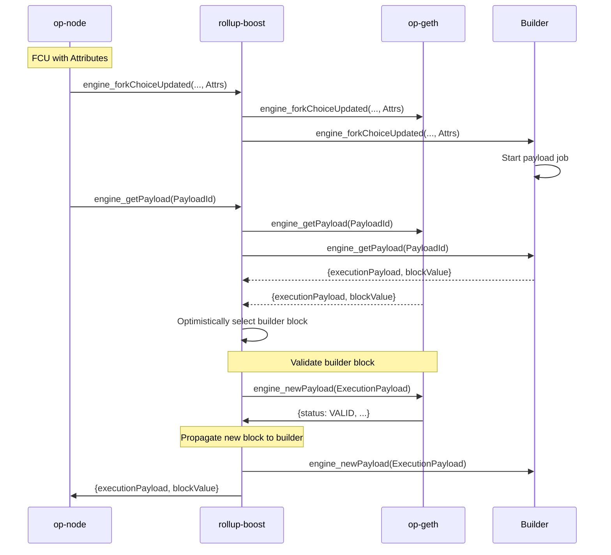

# Table of Contents

- [Context/Scope](#contextscope)
  - [Goals](#goals)
  - [Non Goals](#non-goals)
- [Design](#design)
  - [Overview](#overview)
  - [Health Checks]()
  - [DebugAPI]()
  - [Failure Scenarios](#failure-scenarios)

# Context/Scope

The current OP Stack sequencer HA design relies on `op-conductor` to manage a cluster of sequencers. Each node runs a local conductor instance, and the cluster forms a Raft quorum to elect a single leader responsible for block production. The conductor continuously monitors the health of the sequencer, electing a new leader when the current leader is unhealthy. The leader notifies it's local sequencer to run in sequencing mode, allowing `op-node` to send FCUs with payload attributes signaling the execution client to build a new payload. All follower instances are run without sequencer mode enabled, ensuring that only one sequencer is producing blocks at a time.

  

With the introduction of `rollup-boost`, an additional component is introduced that sits in-between `op-node` and `op-geth` that forwards Engine API requests to an external builder.

This design document outlines the architecture, components, and failure strategies required for HA `rollup-boost`. The proposed design prioritizes fault tolerance, liveliness, horizontal scalability, and minimal failover time while maintaining upstream compatibility with `op-conductor`.

## Goals

- Explore HA designs for `rollup-boost` prioritizing liveliness, fault tolerance and horizontal scalability for external block builders.
- Maintain compatibility with `op-conductor` and its sequencing assumptions.

## Non Goals

- Define how Flashblocks are handled, consumed or streamed to the network.
- Define how pending transactions are relayed/peered across the builders/sequencer execution clients.
- Monitoring / alerting strategies. This can be specified in a separate document once an architecture is solidified.

# Design

## Overview

The following design builds on the existing HA sequencer setup by introducing a `rollup-boost` instance between each `op-node` and its local `op-geth` instance. In this model, each `rollup-boost` is paired with a single external builder and default execution client. When `op-node` sends an FCU containing payload attributes, `rollup-boost` forwards the request to both the default execution client and its paired builder.

Upon receiving a `get_payload` request from `op-node`, `rollup-boost` forwards the call to both the builder and default execution client. If the builder returns a payload, it is validated via a `new_payload` call to the sequencer's local execution client. If the builder payload is invalid or unavailable, `rollup-boost` falls back to the local execution client’s payload.

In the event of sequencer failover, `op-conductor` elects a new leader, promoting a different `op-node` along with its associated `rollup-boost` and builder instance. Since each builder is isolated and only serves requests from its local `rollup-boost`, no coordination between builders is required. This separation mirrors the existing HA model of the OP Stack, extending it to external block production.

This approach is operationally simple and relies on the same liveness and fault tolerance guarantees already provided by the OP Stack's sequencer HA setup. Note that `rollup-boost` does not currently feature a block selection policy and will optimistically select the builder's block for validation. In the event of a bug in the builder, it is possible valid, but undesirable blocks (eg. empty blocks) are produced. Without a block selection policy, `rollup-boost` will prefer the builder's block over the default execution client. If the builder produces undesirable but valid blocks, operators must either manually disable external block production via the `rollup-boost` debug API, disable the block builder directly (causing health checks to fail), or manually select a new sequencer leader. Proper monitoring alerting can help mitigate this but further designs should be explored to introduce safeguards into rollup-boost directly rather than relying on the builder implementation being correct.

Below is a happy path sequence diagram illustrating how `rollup-boost` facilitates payload construction/validation:

## Health Checks

In high availability deployments, `op-conductor` must assess the full health of the block production path. Rollup Boost will expose a composite `/healthz` endpoint to report on both builder synchronization and payload production status. These checks allow `op-conductor` to detect degraded block building conditions and make informed leadership decisions.

Rollup Boost will continuously monitors two independent conditions to inform the health of the builder and the default execution client:

- **Builder Synchronization**:  
  A background task periodically queries the builder’s latest unsafe block via `engine_getBlockByNumber`. The task compares the timestamp of the returned block to the local system time. If the difference exceeds a configured maximum unsafe interval (`max_unsafe_interval`), the builder is considered out of sync. Failure to fetch a block from the builder or detection of an outdated block timestamp results in the health status being downgraded to Partial. If the builder is responsive and the block timestamp is within the acceptable interval, the builder is considered synchronized and healthy.
- **Payload Production**:  
  During each `get_payload` request, Rollup Boost will verify payload availability from both the builder and the execution client. If the builder fails to deliver a payload, Rollup Boost will report partial health. If the execution client fails to deliver a payload, Rollup Boost will report unhealthy.

| Condition | Health Status |
|:----------|:--------------|
| Builder is synced and both execution client and builder return payloads | `200 OK` (Healthy) |
| Builder is out of sync| `206 Partial Content` (Partially Healthy) |
| Builder fails to return payload on `get_payload` request | `206 Partial Content` (Partially Healthy) |
| Execution client fails to return payload on `get_payload` request | `503 Service Unavailable` (Unhealthy) |

### Integration with op-conductor

`op-conductor` should query the `/healthz` endpoint on each sequencer node alongside existing execution client health checks. Health status should be interpreted as follows:

- `200 OK`: Sequencer is fully healthy and eligible for leadership.
- `206 Partial Content`: Sequencer is partially healthy; eligible only if no fully healthy candidates are available.
- `503 Service Unavailable`: Sequencer is unhealthy; triggers immediate leadership transfer.

Inactive sequencer instances (followers) will only rely on the background sync check since they are not actively producing blocks. This mirrors the liveness guarantees in the existing OP Stack HA model and ensures readiness for rapid promotion during failover events.

## Failure Scenarios

Below is a high level summary of how each failure scenario is handled. All existing failure modes assumed by upstream `op-conductor` are maintained:

| Failure Scenario | Category | Scenario and Solution |
| --- | --- | --- |
| Leader Sequencer Fails | Sequencer Failure | Conductor will detect sequencer failure and start to transfer leadership to another node, which will start sequencing instead. Currently,`op-conductor` will not know if the newly elected sequencer has a healthy builder. In the event that `op-conductor` selects a sequencer with an unhealthy builder, manual intervention is needed to either switch the leader or recover the builder. Once the originally failed sequencer is back online, it will join the sequencer set as a follower. |
| Leader `rollup-boost` Fails | Rollup Boost Failure | Leader sequencer `rollup-boost` fails, causing `op-conductor`s sequencer health checks to fail, notifying conductor to elect a new leader. This failure mode is the same as a typical leader sequencer failure. Once the sequencer `rollup-boost` recovers, the sequencer will rejoin the sequencer set as a follower. |
| Follower `rollup-boost` Fails | Rollup Boost Failure | Follower sequencer `rollup-boost` fails. The leader sequencer is unaffected. Once `rollup-boost` is recovers, the sequencer will rejoin the set as a follower. |
| Leader Builder Fails | Builder Failure| The builder associated with the sequencer leader fails and is no longer producing blocks. `rollup-boost` will fallback to the default execution client's payload and continue to produce blocks. Once the builder has been recovered and synced back to the chain tip, it will continue block production as normal.|
| Follower Builder Fails| Builder Failure| The builder associated with a follower sequencer instance fails. Block production is not interrupted. Once the builder has been recovered it will sync back to the chain tip and process FCUs as normal.|
| Leader Builder Producing Bad Blocks| Builder Failure| In this scenario, the builder is "healthy" but producing bad blocks (eg. empty blocks). If the builder block passes validation via a `new_payload` call to the default execution client, it will be proposed to the network. Manual intervention is needed to either switch to a different sequencer or shutoff the builder. Further mitigation can be introduced via block selection policy allowing `rollup-boost` to select the "healthiest" block. Currently, it is unclear what block selection policy would provide the strongest guarantees.|

 

## Additional Considerations

### Emergency Shutoff Switch

To ensure safe and reliable block production, `rollup-boost` could expose an emergency shutoff switch that allows operators to disable external block production in the event of a critical or unexpected failure that affects block production/liveliness where automated recovery mechanisms do not cover. This mechanism could be an API that enables a flag causing `rollup-boost` to bypass all external builders and use the default execution client's payload exclusively.
