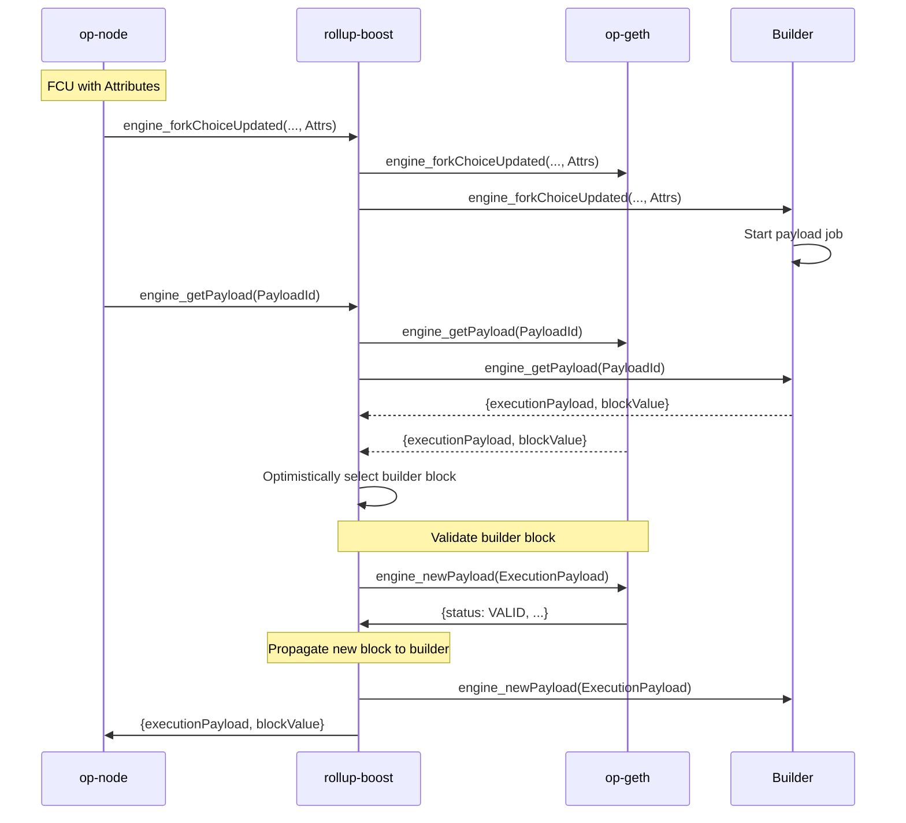
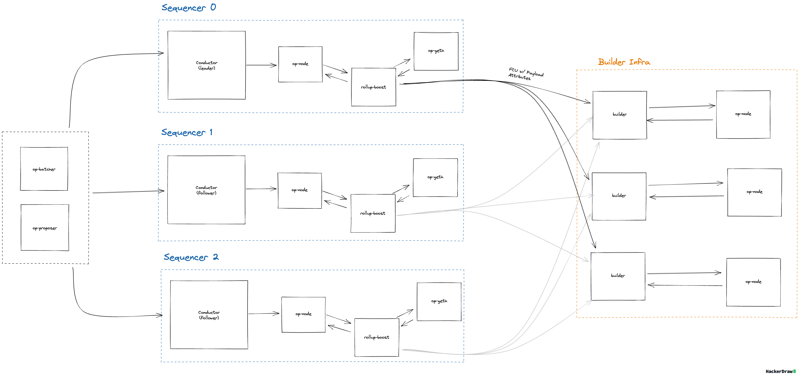
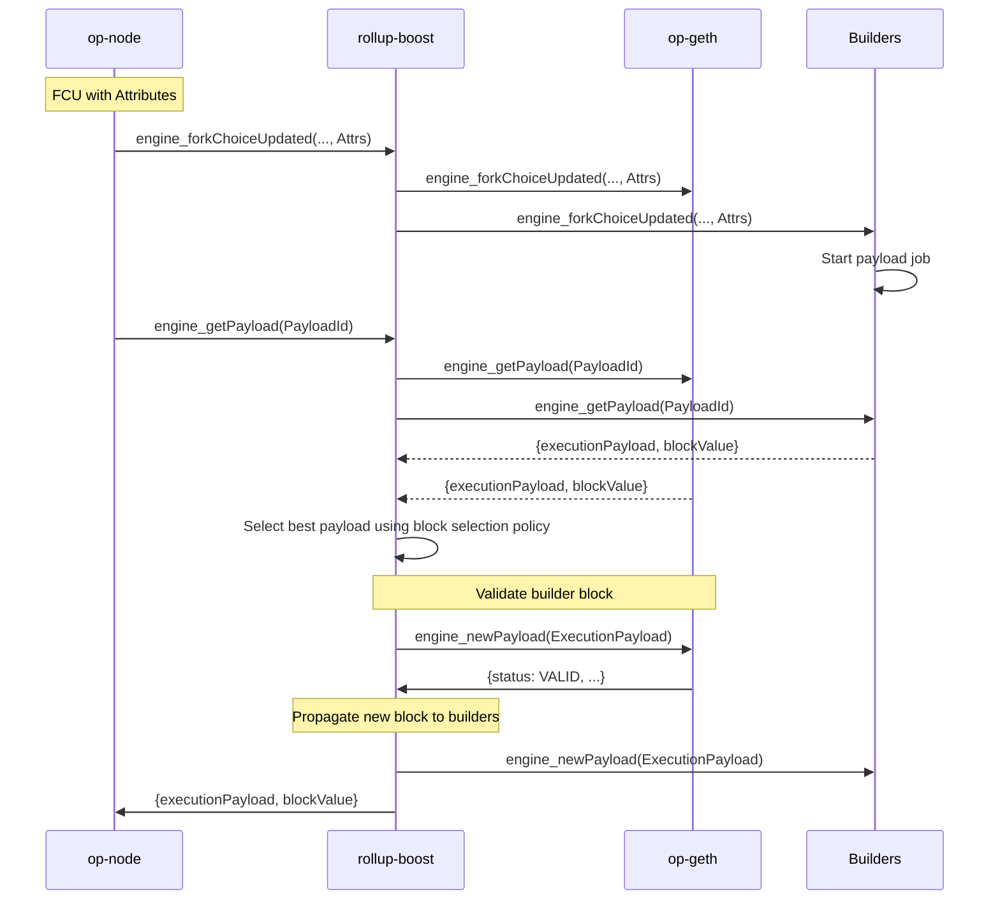
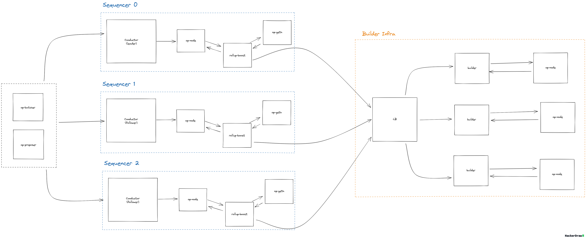
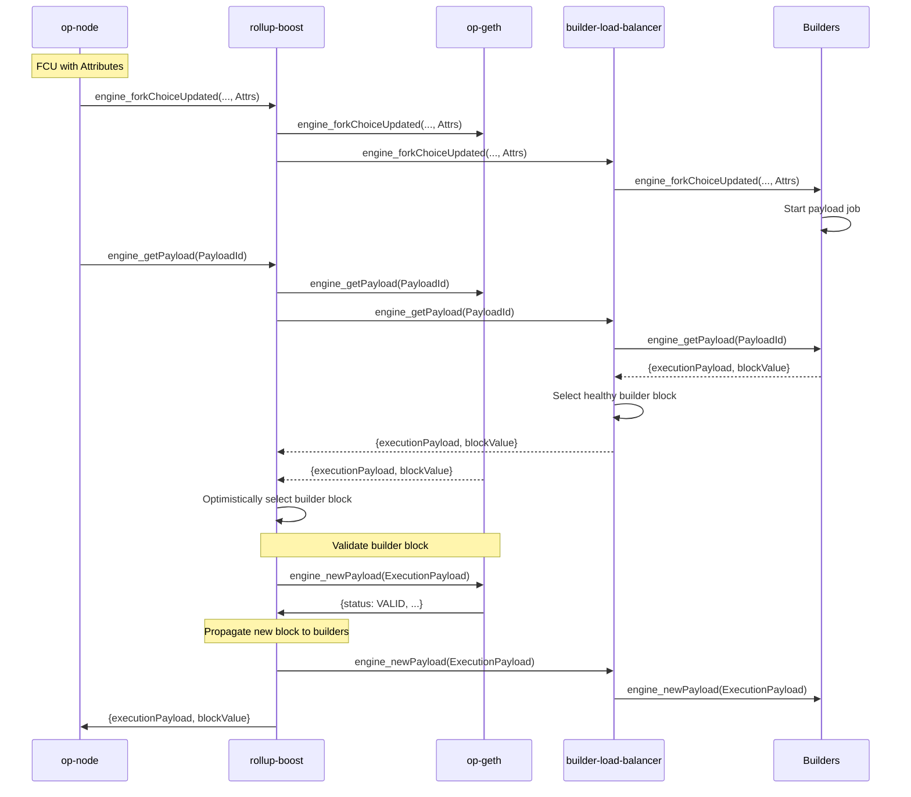

# Table of Contents

- [Context/Scope](#contextscope)
  - [Goals](#goals)
  - [Non Goals](#non-goals)
- [Designs](#designs)
  - [1:1 Rollup Boost to Builder Deployments](#11-rollup-boost-to-builder-deployments)
    - [Failure Scenarios](#failure-scenarios)
    - [Pros/Cons](#pros-and-cons)
  - [`n` Block Builders](#n-block-builders)
    - [Failure Scenarios](#failure-scenarios-1)
    - [Pros/Cons](#pros-and-cons-1)
  - [Builder Load Balancer](#builder-load-balancer)
    - [Failure Scenarios](#failure-scenarios-2)
    - [Pros/Cons](#pros-and-cons-2)
- [Additional Considerations](#additional-considerations)

# Context/Scope

The current OP Stack sequencer HA design relies on `op-conductor` to manage a cluster of sequencers. Each node runs a local conductor instance, and the cluster forms a Raft quorum to elect a single leader responsible for block production. The conductor continuously monitors the health of the sequencer, electing a new leader when the current leader is unhealthy. The leader notifies it's local sequencer to run in sequencing mode, allowing `op-node` to send FCUs with payload attributes signaling the execution client to build a new payload. All follower instances are run without sequencer mode enabled, ensuring that only one sequencer is producing blocks at a time.

  

With the introduction of `rollup-boost`, an additional component is introduced that sits in-between `op-node` and `op-geth` that forwards Engine API requests to an external builder.

This design document outlines the architecture, components, and failure strategies required for HA `rollup-boost`. The proposed design prioritizes fault tolerance, liveliness, horizontal scalability, and minimal failover time while maintaining upstream compatibility with `op-conductor`.

## Goals
- Explore HA designs for `rollup-boost` prioritizing liveliness, fault tolerance and horizontal scalability for external block builders.
- Maintain compatibility with `op-conductor` and its sequencing assumptions.

## Non Goals
- Define how Flashblocks are handled, consumed or streamed to the network.
- Define how pending transactions are relayed/peered across the builders/sequencer execution clients.
- Monitoring / alerting strategies. This can be specified in a separate document once an architecture is solidified.

# Designs

The following designs build on the existing HA sequencer setup by introducing a `rollup-boost` instance between each `op-node` and its local `op-geth` instance.

## 1:1 Rollup Boost to Builder Deployments

In this design, each `rollup-boost` instance is configured with a single external builder and default execution client. When `op-node` sends an FCU containing payload attributes, `rollup-boost` forwards the request to both the default execution client and its paired builder. Upon receiving a `get_payload` request from `op-node`, `rollup-boost` queries both the execution client and the builder. If the builder returns a payload, it is validated via a `new_payload` request sent to the default execution client. If the builder payload is invalid or unavailable, `rollup-boost` falls back to the execution client's payload.

In the event of sequencer failover, `op-conductor` elects a new leader, promoting a different `op-node` along with its associated `rollup-boost` and builder instance. Since each builder is isolated and only serves requests from its local `rollup-boost`, no coordination between builders is required. This separation mirrors the existing HA model of the OP Stack, extending it to external block production.

This approach is operationally simple and relies on the same liveness and fault tolerance guarantees already provided by the OP Stack's sequencer HA setup. Currently, `op-conductor` health checks only evaluate the state of the default execution client, and are unaware of builder health. In the event that the builder is down, `op-conductor` will not switch over to another sequencer instance. Further, if more than one builder is down, `op-conductor` will not currently know if the builder associated with the incoming leader is healthy or unhealthy. One potential solution would be to point `op-conductor` at `rollup-boost` for health checks which could incorporate both the builder and default execution client health. Alternatively `op-conductor` could feature health checks for `rollup-boost` in addition to the existing health checks.

Note that `rollup-boost` does not currently feature a block selection policy and will optimistically select the builder's block for validation. In the event of a bug in the builder, it is possible valid but undesirable blocks (eg. empty blocks) are produced. Without a block selection policy, `rollup-boost` will prefer these blocks over the default execution client. Proper monitoring alerting can help mitigate this but further designs should be explored to introduce safeguards into `rollup-boost` directly rather than relying on the builder implementation being correct.

Below is a happy path sequence diagram illustrating how `rollup-boost` facilitates payload construction/validation:

### Failure Scenarios

 Failure Scenarios

Below is a high level summary of how each failure scenario is handled. All existing failure modes assumed by upstream `op-conductor` are maintained:

| Failure Scenario | Category | Scenario and Solution |
| --- | --- | --- |
| Leader Sequencer Fails | Sequencer Failure | Conductor will detect sequencer failure and start to transfer leadership to another node, which will start sequencing instead. Currently,`op-conductor` will not know if the newly elected sequencer has a healthy builder. In the event that `op-conductor` selects a sequencer with an unhealthy builder, manual intervention is needed to either switch the leader or recover the builder. Once the originally failed sequencer is back online, it will join the sequencer set as a follower. |
| Leader `rollup-boost` Fails | Rollup Boost Failure | Leader sequencer `rollup-boost` fails, causing `op-conductor`s sequencer health checks to fail, notifying conductor to elect a new leader. This failure mode is the same as a typical leader sequencer failure. Once the sequencer `rollup-boost` recovers, the sequencer will rejoin the sequencer set as a follower. |
| Follower `rollup-boost` Fails | Rollup Boost Failure | Follower sequencer `rollup-boost` fails. The leader sequencer is unaffected. Once `rollup-boost` is recovers, the sequencer will rejoin the set as a follower. |
| Leader Builder Fails | Builder Failure| The builder associated with the sequencer leader fails and is no longer producing blocks. `rollup-boost` will fallback to the default execution client's payload and continue to produce blocks. Once the builder has been recovered and synced back to the chain tip, it will continue block production as normal.|
| Follower Builder Fails| Builder Failure| The builder associated with a follower sequencer instance fails. Block production is not interrupted. Once the builder has been recovered it will sync back to the chain tip and process FCUs as normal.|
| Leader Builder Producing Bad Blocks| Builder Failure| In this scenario, the builder is "healthy" but producing bad blocks (eg. empty blocks). If the builder block passes validation via a `new_payload` call to the default execution client, it will be proposed to the network. Manual intervention is needed to either switch to a different sequencer or shutoff the builder. Further mitigation can be introduced via block selection policy allowing `rollup-boost` to select the "healthiest" block. Currently, it is unclear what block selection policy would provide the strongest guarantees.|

### Pros and Cons

Pros/Cons

#### Pros

- Simple, easy to operate and monitor
- No coordination required between `n` builders

#### Cons

- No builder failover/redundancy
- Resource intensive for chains that do not want to run 3 builders

 

## `n` Block Builders

In this design, each `rollup-boost` instance can be configured with `n` builders. When an FCU with payload attributes is received, it is broadcast to all builders, each of which begins building a block. Once `rollup-boost` receives a `get_payload` request from `op-node`, it multiplexes the request to all builders. Each builder returns its built payload, and if a payload isn't returned within `n` ms, it is ignored. A block selection policy is applied across the successful responses to choose the final payload (eg. selecting the block with the highest gas used). The selected payload is then validated with via a `new_payload` request sent to the sequencer's default execution client. In the event that the selected block is invalid, the next best block is selected and validated with the default execution client instead. If all builder blocks are invalid, then the default execution client's block is selected.

In this HA design, each `rollup-boost` instance is configured to point at the same set of `n` builders. This design assumes that `rollup-boost` will only forward FCUs with payload attributes ( which are only sent by `op-node` when actively sequencing) ensuring that builders only receive build jobs from the current leader. If `op-conductor` elects a new leader, the previous sequencer stops sending FCUs with attributes, and the new leader begins building blocks without any change required at the builder layer. To the builders, the transition is seamless.

While each builder will have its own local `op-node`, to minimize latency and keep builders at the tip, after successful validation of the newly built block `rollup-boost` will forward the `new_payload` request to the builders, rather than relying on each builder to sync state through its own `op-node`.

Below is a happy path sequence diagram illustrating how `rollup-boost` interacts with multiple builders during payload construction/validation. Note that this is exactly the same as 1:1 `rollup-boost` <-> builder block production, with the addition of a block selection policy:

This design ensures builder fault tolerance without compromising any fault tolerance/liveliness guarantees provided by the canonical HA sequencer setup. In an HA setup, a chain can run `n` builders for redundancy. If `n-1` builders go down, the remaining builder will still produce a block. If all builders are down, `rollup-boost` will fallback to the default execution client's block. This enables smooth upgrades and rolling deployments without disrupting external block production.

The setup is flexible, allowing chains to decide how to provision their builder infrastructure however best fits their use case. Chains can run a single builder, `n` builders, a load-balanced set of builders behind a single builder endpoint, or multiple independent builders operated by different trusted parties. No coordination is required between builders, so operational overhead stays low as builder participation expands.

Importantly, this design requires no changes to `op-conductor`, allowing Conductor simply query `op-node` for health checks, keeping builder health and state completely out of the leader election process.

One potential issue with this design is that `op-conductor` does not strictly guarantee there will only be one active sequencer at a time. Specifically, there are edge cases where the `stopSequencer` call is not received in time (or if the call fails) by the previous leader’s `op-node` after a conductor failover. This edge case is acknowledged in the [op-conductor codebase and currently considered acceptable](https://github.com/ethereum-optimism/optimism/blob/273fd6abd4a92824e05f3daa9322b0c8add9e843/op-conductor/conductor/service.go#L766). The [Engine API](https://github.com/ethereum/execution-apis/blob/main/src/engine/common.md#load-balancing-and-advanced-configurations) spec states it is undefined behavior when multiple consensus clients concurrently control the head of a single execution client. Some clients may tolerate this, but it’s not standardized and could lead to unpredictable behavior.

### Failure Scenarios

 Failure Scenarios

Below is a high level summary of how each failure scenario is handled. All existing failure modes assumed by upstream `op-conductor` are maintained:

| Failure Scenario | Category | Scenario and Solution |
| --- | --- | --- |
| Leader `rollup-boost` Fails | Rollup Boost Failure | Leader sequencer `rollup-boost` fails, causing `op-conductor`s sequencer health checks to fail, notifying conductor to elect a new leader. This failure mode is the same as a typical leader sequencer failure. Once the sequencer `rollup-boost` recovers, the sequencer will rejoin the sequencer set as a follower. |
| Follower `rollup-boost` Fails | Rollup Boost Failure | Follower sequencer `rollup-boost` fails. The leader sequencer is unaffected. Once `rollup-boost` is recovers, the sequencer will rejoin the set as a follower. |
| `n-1` Builder Failures | Builder Failure | External block production will continue as normal. As long as there is one external block builder available, the healthy instance will continue to produce blocks. Once the builders recover or are manually brought back online, they will join the builder set and continue to operate as normal. |
| All Builders Fail | Builder Failure | `rollup-boost` will forward FCU with payload attributes to the builder endpoints as normal. Upon a `get_payload` request, if there are no healthy builders available, no builder block will be returned. `rollup-boost`'s block selection logic will time out and fallback to the default execution client's block |
|Multiple Sequencers Send FCUs w/ Payload Attrs|OP Conductor Failure|In this failure mode, the `stopSequencer` call either fails to send or is delayed causing two sequencers to send FCUs with payload attributes to the builder network. It is unclear what affect this may have depending on the execution client implementation.|

### Pros and Cons

Pros/Cons

#### Pros

- Supports builder redundancy and high availability  
- Compatible with existing `op-conductor`  
- Resilient to individual builder failures and rolling deployments  
- Flexible setup allowing chains can choose single, multiple, or third-party builders  

#### Cons

- No strict guarantee builders only receive one FCU with payload attributes.
- Block selection logic adds complexity to `rollup-boost`  

 

## Builder Load Balancer

In this design, all `rollup-boost` instances forward requests to a single builder endpoint that load balances across a cluster of builder nodes. When an FCU with payload attributes is received, the request is relayed to the load balancer which fans it out to all builders concurrently. Upon receiving a `get_payload` request from `rollup-boost`, the load balancer forwards the `get_payload` request to all builders and selects a block from the successful responses. Alternatively, the load balancer could preform a health check identifying which builders have successfully produced payloads and select one of the healthy responses to return to `rollup-boost`.

This design prioritizes builder fault tolerance compared to a 1:1 (sequencer-to-builder) mapping or a single builder model. As long as any builder in the cluster is healthy, the builder block will be selected regardless of which sequencer instance is currently active. This ensures liveness in the case of builder failures or during rolling deployments. This also allows a chain operator to scale builders horizontally and in various availability zones (or infra providers) without needing to adjust any sequencer infrastructure.

This design is also fully compatible with upstream `op-conductor` and requires no changes to conductor logic. In the event that `op-conductor` triggers a change in sequencer leader, the builder layer remains unaffected. If all builders are offline, each instance of `rollup-boost` will fallback to the default execution client block ensuring chain liveliness.

In the failure case where `op-conductor` fails to send a `stopSequencing` call in time resulting in two FCUs with payload attributes, the builder load balancer could feature logic to dedup/ignore the additional payload, avoiding the issue of having more than one CL drive the EL at a time.

Below is a happy path sequence diagram illustrating payload construction/validation:

### Failure Scenarios

 Failure Scenarios

Below is a high level summary of how each failure scenario is handled. All existing failure modes assumed by upstream `op-conductor` are maintained:

| Failure Scenario | Category | Scenario and Solution |
| --- | --- | --- |
| Leader `rollup-boost` Fails | Rollup Boost Failure | Leader sequencer `rollup-boost` fails, causing `op-conductor`s sequencer health checks to fail, notifying conductor to elect a new leader. This failure mode is the same as a typical leader sequencer failure. Once the sequencer `rollup-boost` recovers, the sequencer will rejoin the sequencer set as a follower. The new sequencer sends FCUs with payload attributes to the load balancer, which continues to facilitate external block prodcution as normal.|
| Follower `rollup-boost` Fails | Rollup Boost Failure | Follower sequencer `rollup-boost` fails. The leader sequencer is unaffected. Once `rollup-boost` is recovers, the sequencer will rejoin the set as a follower. |
| `n-1` Builder Failures | Builder Failure | External block production will continue as normal. As long as there is one external block builder available, the healthy instance will continue to produce blocks. Once the builders recover or are manually brought back online, they will join the builder set and continue to operate as normal. This does not cause a sequencer failover.|
| All Builders Fail | Builder Failure | `rollup-boost` will forward FCU with payload attributes to the builder endpoints as normal. Upon a `get_payload` request, if there are no healthy builders available, no builder block will be returned. `rollup-boost`'s block selection logic will time out and fallback to the default execution client's block. This does not result in a sequencer failover.|
|Multiple Sequencers Send FCUs w/ Payload Attrs|OP Conductor Failure|In this failure mode, the `stopSequencer` call either fails to send or is delayed causing two sequencers to send FCUs with payload attributes to the builder network. The load balancer will either dedup or ignore the second request, ensuring only one FCU with payload attributes is sent to the builder network.|

### Pros and Cons

Pros/Cons

#### Pros

- Single builder endpoint, scale horizontally without needing to involve sequencer operator.
- Potentially reduces operational overhead for sequencer operator

#### Cons

- Adds additional infra to maintain
- Adds additional complexity (builder health checks, fanout logic, routing logic)
- Assumes a single party operates/coordinates all external block builders
- Load balancer can become single point of failure for builder network

 

## Additional Considerations

### Emergency Shutoff Switch

To ensure safe and reliable block production, `rollup-boost` could expose an emergency shutoff switch that allows operators to disable external block production in the event of a critical or unexpected failure that affects block production/liveliness where automated recovery mechanisms do not cover. This mechanism could be an API that enables a flag causing `rollup-boost` to bypass all external builders and use the default execution client's payload exclusively.
