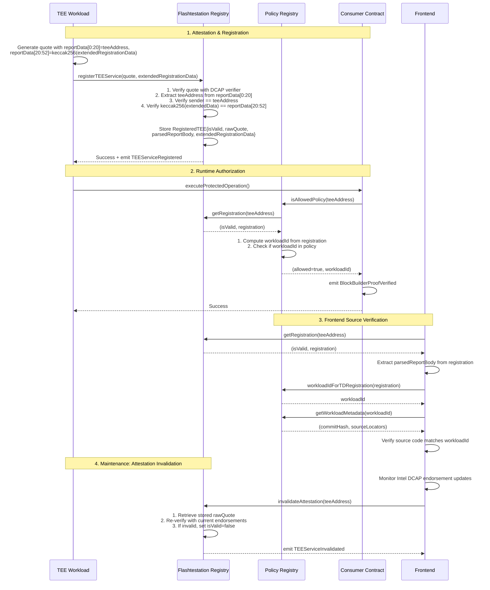

 Flashtestations: Transparent Onchain TEE Verification and DCAP Attestation Registry Protocol

*Authors: [fnerdman](https://github.com/fnerdman), [Melville](https://github.com/Melvillian), [dmarz](https://github.com/dmarzzz), [Ruteri](https://github.com/Ruteri)*

**Table of Contents**
- [Abstract](#abstract)
- [Prerequisites](#prerequisites)
- [Motivation](#motivation)
- [Specification](#specification)
  - [Terminology](#terminology)
    - [Intel TDX Primitives](#intel-tdx-primitives)
    - [Flashtestations Protocol Components](#flashtestations-protocol-components)
    - [Operational Terms](#operational-terms)
  - [Data Structures](#data-structures)
    - [**`TDReport`**](#tdreport)
    - [**`DCAPEndorsements`**](#dcapendorsements)
    - [**`RegisteredTEE`**](#registeredtee)
    - [**`Extended Registration Data`**](#extended-registration-data)
  - [System Architecture](#system-architecture)
  - [TEE Attestation Mechanism](#tee-attestation-mechanism)
    - [Intel TDX DCAP Attestation](#intel-tdx-dcap-attestation)
    - [Onchain DCAP Attestation](#onchain-dcap-attestation)
  - [Flashtestation Registry](#flashtestation-registry)
    - [Core Concepts](#core-concepts)
    - [Key Relationship Model](#key-relationship-model)
    - [Fundamental Operations](#fundamental-operations)
    - [Key Requirements](#key-requirements)
    - [Attestation Verification Endpoint](#attestation-verification-endpoint)
  - [Policy Layer: Flexible Authorization](#policy-layer-flexible-authorization)
    - [Policy Abstraction](#policy-abstraction)
    - [Policy Operations](#policy-operations)
  - [End-to-End Flow](#end-to-end-flow)
    - [Attestation and Registration](#attestation-and-registration)
    - [Runtime Authorization](#runtime-authorization)
    - [Maintenance: Handling Changing Endorsements](#maintenance-handling-changing-endorsements)
    - [Gas Cost Considerations and Future Optimizations](#gas-cost-considerations-and-future-optimizations)
  - [Offchain TEE Verification](#offchain-tee-verification)
    - [Example Verification Flow](#example-verification-flow)
  - [Transparency Log](#transparency-log)
    - [Purpose and Benefits](#purpose-and-benefits)
    - [Logged Information](#logged-information)
    - [Implementation Approach](#implementation-approach)
    - [Relationship with Registry](#relationship-with-registry)
- [Security Assumptions](#security-assumptions)
- [Rationale](#rationale)
  - [Replacement Model](#replacement-model)
  - [Gas Optimization](#gas-optimization)
  - [Separation of Concerns](#separation-of-concerns)
  - [Block Builder TEE Proofs](#block-builder-tee-proofs)
    - [Core Mechanism](#core-mechanism)
    - [Block Building Process](#block-building-process)
    - [Verification Contract](#verification-contract)
    - [Security Properties](#security-properties)


# Abstract

Integrating TEEs with dapps presents significant challenges. Flashtestations frames the onchain representation of a TEE through its **`TEE-controlled address`**—an onchain identifier for an entity that can operate as a verifiable offchain smart contract or [**TEE Coprocessor**](https://writings.flashbots.net/suave-tee-coprocessor). For such entities to be trusted and usable by onchain smart contracts, key questions must be addressed: How can their authenticity and the code they run be cryptographically verified? How can this verification scale efficiently onchain and be maintained as hardware security requirements evolve?

Flashtestations addresses these challenges by providing a comprehensive onchain protocol for TEE verification, **`TEE-controlled address`** registration, and transparent record-keeping. The protocol enables:

1.  Onchain verification of Intel TDX attestations against current Intel endorsements.
2.  Maintenance of a curated Registry of **`TEE-controlled addresses`** associated with their respective DCAP Attestations.
3.  Policy-based authorization for TEE services (including TEE Coprocessors identified by their **`TEE-controlled address`**) to securely interact with smart contracts.
4.  Transparent logging of all attestation events and endorsement changes.

# Prerequisites

This document assumes familiarity with the following background material, specifications, and tooling. Items are arranged in the rough order they become relevant while reading this spec:

1. **Intel TDX Architecture & Security Model** — core concepts, measurement registers, Trust Domain isolation, and attestation flows.
   — [Intel TDX Specifications and Developer Guides](https://www.intel.com/content/www/us/en/developer/tools/trust-domain-extensions/documentation.html)
2. **Intel DCAP Attestation Stack** — Quote generation, signature scheme and collateral (QE Identity & TCB Info) retrieval.
   — [Intel TDX DCAP Quoting Library API](https://download.01.org/intel-sgx/latest/dcap-latest/linux/docs/Intel_TDX_DCAP_Quoting_Library_API.pdf)
3. **On‑Chain DCAP Quote Verification** — Solidity contracts that decode DCAP quotes and perform cryptographic validation using PCCS‑sourced endorsements.
   — [Automata DCAP Attestation Contract](https://github.com/automata-network/automata-dcap-attestation)
4. **On‑Chain Endorsement Storage (PCCS)** — Automata’s Solidity implementation that mirrors Intel collateral on Ethereum, enabling fully reproducible verification.
   — [Automata On‑chain PCCS](https://github.com/automata-network/automata-on-chain-pccs)

# Motivation

The integration of Trusted Execution Environments (TEEs) with onchain applications offers transformative potential, particularly for enabling sophisticated **TEE Coprocessors**. These entities, which can function as verifiable offchain smart contracts and are identified onchain by their **`TEE-controlled address`**, can execute complex or confidential tasks. Realizing this potential, however, requires addressing fundamental questions regarding their verification, scalability, and maintainability within the blockchain environment:

* How can onchain smart contracts cryptographically verify they are interacting with an authentic TEE (represented by its **`TEE-controlled address`**) running the intended software?
* How can this verification scale efficiently onchain for regular use?
* How can an up-to-date registry of validated TEEs be maintained as their underlying hardware security requirements and endorsements (like Intel DCAP endorsements) evolve?
* How can these processes be transparent to foster trust within the ecosystem?

Flashtestations is motivated by the need to solve these fundamental problems of TEE and onchain interaction and provides an onchain protocol that serves as a crucial building block for this interaction. This protocol primarily enables secure **TEE outbound calls** - allowing TEEs to make calls to onchain smart contracts and be verifiably authorized via their **`TEE-controlled address`**. Furthermore, by facilitating the onchain availability of verified TEE public keys (derived from `ReportData` in the attestation quote), it lays a crucial foundation for secure **TEE inbound calls**. This equips users and smart contracts with the trusted information needed to establish secure communication channels with attested TEEs. By providing these foundational elements, Flashtestations empowers the development of a robust ecosystem.

To achieve this, Flashtestations aims for the following objectives:

1.  **Security (Verifiable TEE Interaction)**: To provide irrefutable cryptographic proof that a **`TEE-controlled address`**, is backed by a genuine TEE executing specific, measured code (its **`workloadId`**). This ensures all interactions involving TEEs are resistant to spoofing and unauthorized code execution.

2.  **Efficiency (Performant Onchain Integration)**: To ensure that critical onchain operations, particularly the lookup and validation of the TEE's status via its **`TEE-controlled address`**, are highly gas-efficient (aiming for O(1) complexity). This is vital for enabling frequent and cost-effective TEE outbound and TEE inbound calls.

3.  **Maintainability (Dynamic Trust Anchoring)**: To support the efficient updating of the TEE registry as underlying TEE security endorsements evolve. This ensures the trustworthiness of registered TEEs remains aligned with current security standards over time.

4.  **Transparency (Auditable Ecosystem)**: To maintain a publicly accessible and auditable record of TEE attestations (as described in the Transparency Log section), including their **`workloadId`**s, and any changes to their validation status. This fosters accountability and allows for independent security analysis, building broader trust for all TEE-onchain interactions.

# Specification

## System Architecture

Within the Flashtestations specification, the protocol architecture consists of four key components that work together to provide secure onchain TEE verification:

```
┌─────────────────────────┐                  ┌─────────────────────┐
│ TDX VM                  │                  │ Onchain Verifier    │
│                         │  Attestation     │                     │
│ ┌─────────────────┐     │  Quote           │ ┌─────────────────┐ │
│ │ TEE Workload    │     │ ───────────────► │ │ DCAP Attestation│ │
│ │                 │     │                  │ │ Verifier        │ │
│ │ (measurements)  │     │                  │ │                 │ │
│ └─────────────────┘     │                  │ └────────┬────────┘ │
│                         │                  │          │          │
└─────────────────────────┘                  │          ▼          │
                                             │ ┌─────────────────┐ │
┌─────────────────────────┐                  │ │ Intel           │ │
│ Consumer Contract       │                  │ │ Endorsements    │ │
│                         │                  │ │                 │ │
│ ┌─────────────────┐     │                  │ └────────┬────────┘ │
│ │ Operation       │     │                  │          │          │
│ │ Authorization   │     │                  │          ▼          │
│ └─────────────────┘     │                  │ ┌─────────────────┐ │
│         │               │                  │ │ Registration    │ │
└─────────┼───────────────┘                  │ │ Logic           │ │
          │                                  │ └────────┬────────┘ │
          │                                  └──────────┼──────────┘
          │                                             │
┌─────────▼──────────────┐                              ▼
│ Policy                 │                  ┌───────────────────────────┐
│                        │  isValid         │ Flashtestation Registry   │
│ ┌─────────────────────┐│  Query           │                           │
│ │ allowedWorkloadIds[]││ ◄───────────────►│ {teeAddress: registration}│
│ │ {registration:      ││                  │   map                     │
│ │   workloadId} map   ││                  │                           │
│ └─────────────────────┘│                  └───────────────────────────┘
└────────────────────────┘
```

1. **Onchain Verifier**: Validates TDX attestation quotes against current Intel endorsements
2. **Flashtestation Registry**: Tracks which addresses have valid attestations for specific workload registrations
3. **Policy Registry**: Defines which workloads are acceptable for specific onchain interactions
4. **Transparency Log**: Records all attestations and endorsement changes (implemented via events)

## Terminology

The terms in this section are used consistently throughout the specification documents. When a term is first mentioned elsewhere, it links back here.

### Intel TDX Primitives

**Trusted Execution Environment (TEE)**: Hardware-based isolated execution environment that protects code and data from the host operating system and other applications. In Intel TDX, the isolation boundary is the "Trust Domain" (TD) rather than the bare CPU.

**Intel TDX ([Trust Domain Extensions](https://www.intel.com/content/www/us/en/developer/tools/trust-domain-extensions/documentation.html))**: Intel's TEE technology for virtual machines that provides hardware-enforced isolation, integrity verification, and attestation capabilities. TDX creates isolated Trust Domains (TDs) inside virtual machines.

**Attestation**: The cryptographic process by which a TEE proves its identity and integrity to a verifier. Produces a signed structure (Quote) containing measurements and claims about the TEE's state.

**DCAP ([Data Center Attestation Primitives](https://download.01.org/intel-sgx/latest/dcap-latest/linux/docs/Intel_TDX_DCAP_Quoting_Library_API.pdf))**: Intel's attestation system designed for data centers that enables verification without requiring direct communication with Intel for each attestation check.

**Quote**: The cryptographically signed data structure produced during attestation, containing measurement registers and report data fields that uniquely identify the TEE and its contents. Flashtestations scope currently only supports the DCAP v4 Quote format for TDX.

**Intel DCAP endorsements**: Data provided by Intel that serves as the trust anchor for attestation verification. This includes QE Identity information, TCB Info, certificates, and related data. Also referred to as "Endorsements" in some contexts.

**Collateral**: See Intel DCAP endorsements. It carries the same meaning. This is not monetary collateral as in crypto-economic systems. Some sources, such as Automatas [onchain PCCS](https://github.com/automata-network/automata-on-chain-pccs) uses collateral as the go to term.

**TCB (Trusted Computing Base)**: The set of hardware, firmware, and software components critical to a system's security. In TDX, the TCB includes Intel CPU hardware, microcode, and firmware components that must be at approved security levels.

**Measurement Registers**: Hardware-enforced registers within the TEE (MRTD, RTMRs, MROWNER, etc.) that capture cryptographic hashes of code, data, and configuration loaded into the environment. These registers take part in forming the workload identity.

**REPORTDATA**: A 64-byte field in the attestation quote containing data defined by the TDX VM. In Flashtestations, this field is structured as:

```
REPORTDATA[0:20]: The TEE-controlled address
REPORTDATA[20:52]: keccak256(extendedRegistrationData) - Hash of application-specific data, currently empty. Reserved for future upgrades
REPORTDATA[52:64]: Unused
```

**Quote Enclave (QE)**: Intel-provided enclave responsible for signing attestation quotes using Intel-provisioned keys. The QE creates the cryptographic binding between measurement registers and the attestation signature.

**Provisioning Certification Service (PCS)**: Intel's service that provides the certificates and related data needed to verify attestation quotes. In Flashtestations, we use Automata's onchain PCCS, which stores this data on the blockchain.

**Attestation Key (AK)**: The cryptographic key used by the Quote Enclave to sign attestation quotes. The validity of this key is established through a certificate chain back to Intel.

**TDAttributes**: Hardware-enforced attributes that describe the security properties and configuration of a Trust Domain, including settings that affect the TEE's isolation guarantees and security posture.

**XFAM (Extended Features and Attributes Mask)**: A hardware register that indicates which CPU extended features (such as specific instruction sets or security capabilities) are enabled and available for use within the Trust Domain.

**TEE-controlled address**: An Ethereum address whose private key was generated inside a TEE and never leaves the TEE boundaries. The TEE uses this address to authenticate itself in onchain transactions, providing cryptographic proof of TEE control over the address.

### Flashtestations Protocol Components

**Workload**: The specific software running inside a TEE. Its identity is derived from measurement registers that contain cryptographic hashes of loaded code and configuration.

**`workloadId`**: A 32-byte hash uniquely identifying a specific TEE workload based on its measurement registers, derived and authorized by the policy contract.

**`extendedRegistrationData`**: ABI-encoded application-specific attested data that is cryptographically bound to the attestation quote through the `REPORTDATA` field. Currently empty, reserved for future use. The registration data can include for example runtime configuration of the VM, identity of the VM operator, public IP of the instance.

**Policy Registry**: A mapping system that groups related workload identities under a single policy identifier, enabling flexible authorization rules without modifying consumer contracts.

**Flashtestation Registry**: The onchain data structure that maintains a 1:1 mapping from TEE-controlled addresses to valid DCAP attestations. Implemented as the FlashtestationRegistry contract.

**Transparency Log**: The onchain event-based system that records all attestation verifications, registry changes, and endorsement updates for auditability. Implemented through emitted blockchain events rather than as a separate logging service.

**`Endorsement Version`**: The specific version of Intel DCAP endorsements at a point in time. Endorsements change periodically as Intel releases updates or discovers vulnerabilities in hardware or firmware.

**Onchain Verifier**: The smart contract component (using Automata's DCAP attestation system) that validates TDX attestation quotes against current Intel DCAP endorsements and interacts with the Flashtestation Registry to register TEE-controlled addresses.

**PCCS (Provisioning Certificate Caching Service)**: Automata's onchain implementation of Intel's PCCS that stores Intel DCAP endorsements on the blockchain, making it available for attestation verification. This ensures all verification is reproducible on L2.

### Operational Terms

**Registration**: The process of adding a TEE-controlled address to the registry after successful attestation verification.

**Endorsement Revocation**: The process of marking attestations as outdated when Intel updates its security requirements.

**Housekeeping**: The maintenance process of verifying and updating attestation status when endorsements change. This can be done on-demand via the attestation verification endpoint.

**TCB Recovery**: The process that occurs when Intel releases updates to address security vulnerabilities in the TCB components. This typically requires updating the list of secure endorsements.

**Reproducible Build**: A deterministic build process that ensures anyone building the same source code will produce identical binary outputs, enabling verification of expected TEE measurements.

**TEE Infrastructure Operator**: The entity that has control over the TEE deployment, including the ability to set values in measurement registers such as MROWNER, MRCONFIGID, and MROWNERCONFIG before VM startup.

## Data Structures

The protocol defines several key data structures:

### **`TDReport`**

The TD Report includes the core information used for attestation of the TDX Quote. This spec only references elements in the report; a full quote also has a header and signature data.

```python
class TDReport():
    TEETCBSVN: Bytes16
    MRSEAM: Bytes48
    SEAMATTRIBUTES: bytes8
    MRSIGNERSEAM: Bytes48
    MRTD: Bytes48
    RTMR: List[Bytes48, size=4]
    MROWNER: Bytes48
    MROWNERCONFIG: Bytes48
    MRCONFIGID: Bytes48
    TDAttributes: Bytes8
    XFAM: Bytes8
    ReportData: Bytes64
```

**Field descriptions:**

- `TEETCBSVN`: TEE Trusted Computing Base Security Version Numbers (SVNs); indicates platform patch level. Checked against onchain collateral.
- `MRSEAM`: Measurement of the TDX SEAM module itself. Checked against onchain collateral.
- `SEAMATTRIBUTES`: TDX SEAM module attributes. All zeroes in production mode, checked against onchain collateral.
- `MRSIGNERSEAM`: Measurement of the TDX SEAM module's signer (Intel). Checked against onchain collateral.
- `MRTD`: Initial TD measurement (boot loader, initial data). Should be part of the WorkloadId.
- `RTMR`: Runtime measurements (linux kernel, initramfs, etc.). Should be part of the WorkloadId.
- `MROWNER`: Measurement register that takes arbitrary information and can be set by the TEE infrastructure operator before the startup of the VM. Currently not used.
- `MROWNERCONFIG`: same as `MROWNER`
- `MRCONFIGID`: same as `MROWNER`
- `TDAttributes`: Attributes describing the security properties and configuration of the Trust Domain. Should verify the debug flag is not enabled unknowingly.
- `XFAM`: Extended Features and Attributes Mask, indicating which CPU extended features are enabled for the Trust Domain.
- `ReportData`: Confidential VM–defined data included in the report (currently TEE-controlled address and hash of extendedRegistrationData).

### **`DCAPEndorsements`**

Data provided by Intel to verify the authenticity of a TDX Quote.

```python
class DCAPEndorsements():
    QEIdentity: Bytes
    TCBInfo: Bytes
    QECertificationData: Bytes
```

**Field descriptions:**

- `QEIdentity`: Quoting Enclave Identity.
- `TCBInfo`: Trusted Computing Base information.
- `QECertificationData`: Certification data for the attestation key.

### **`RegisteredTEE`**

```python
class RegisteredTEE():
    isValid: Boolean                    # True upon first registration, false after invalidation
    rawQuote: bytes                     # The raw quote from the TEE device
    parsedReportBody: TD10ReportBody    # Parsed TDX report body for efficient access
    extendedRegistrationData: bytes     # Application-specific data bound to the attestation
```

**Field descriptions:**

- `parsedReportBody`: Parsed form of the quote for use in generating workloadId
- `rawQuote`: The raw quote from the TEE device, which is stored to allow for future quote invalidation
- `extendedRegistrationData`: The application-specific attested data, reserved for future upgrades
- `isValid`: True upon first registration, and false after a quote invalidation

### **`Extended Registration Data`**

The protocol supports binding additional application-specific data to TEE attestations through the `extendedRegistrationData` field. This enables applications to attest to configuration, public keys, or other data alongside the TEE identity.

Key properties:
- The hash of this data is included in `reportData[20:52]` of the attestation
- The actual data is stored in the registry for retrieval
- Applications can use this for TEE-specific configuration or capabilities
- Currently supports up to 20KB of data (same limit as quotes)

Example use cases:
- VM operator public keys for signature verification
- Runtime configuration parameters
- Service endpoints or network addresses
- Application-specific capability declarations

## TEE Attestation Mechanism

Attestation is the process by which a TEE proves its identity and integrity. This section of the specification defines how the protocol uses Intel TDX with DCAP (Data Center Attestation Primitives) attestation.

### Intel TDX DCAP Attestation

TDX attestation produces a Quote structure which among header and signature contains a [TDReport](#tdreport)

The attestation process follows these steps:

1. The TEE generates a TD Report containing its measurement registers and report data
2. The Quote Enclave (QE) creates a Quote by signing the TD Report with an Attestation Key
3. The Quote can be verified against Intel's Provisioning Certification Service (PCS)

### Onchain DCAP Attestation

The following code sample illustrates how DCAP attestation verification is performed onchain, and how the key components (workloadId, quote, and TEE-controlled address) are extracted and registered in the Flashtestations registry:

```solidity
function registerTEEService(bytes calldata rawQuote, bytes calldata extendedRegistrationData) external {
    // Verify the DCAP quote
    (bool success, bytes memory output) = attestationContract.verifyAndAttestOnChain(rawQuote);
    require(success, "Invalid DCAP quote");

    // Parse the report body
    TD10ReportBody memory reportBody = QuoteParser.parseV4VerifierOutput(output);

    // Extract TEE address and extended data hash from reportData
    (address teeAddress, bytes32 extDataHash) = QuoteParser.parseReportData(reportBody.reportData);

    // Verify sender controls the TEE address
    require(msg.sender == teeAddress, "Sender must match TEE address");

    // Verify extended data binding
    require(keccak256(extendedRegistrationData) == extDataHash, "Invalid registration data");

    // Store the full attestation data
    registeredTEEs[teeAddress] = RegisteredTEE({
        isValid: true,
        rawQuote: rawQuote,
        parsedReportBody: reportBody,
        extendedRegistrationData: extendedRegistrationData
    });
}
```

This implementation highlights several key aspects:
1. The DCAP attestation is verified using Automata's onchain verifier
2. The TEE-controlled address is extracted from the attested data
3. The extracted information and raw quote are registered in the registry

## Flashtestation Registry

The Flashtestation Registry is a core component of Flashtestations that maintains a 1:1 mapping between TEE-controlled addresses and their TEE attestations. It acts as a bookkeeper for tracking which TEE-controlled addresses have successfully passed attestation verification. Its purpose is to provide a data structure optimistically filled with up-to-date attestation data. In itself it does not provide any filtering in regards to the content of the TEEs.

### Core Concepts

At its most abstract level within this specification, the Flashtestation Registry is responsible for:

1. **Storing addresses** that have been validated through attestation
2. **Associating addresses** with their specific workload identity
3. **Storing attestation quotes** for future verification and revocation, as well as the extendedRegistrationData
4. **Providing efficient lookup** capabilities to verify if an address is authorized for a particular workloadID

The registry operates on these key abstractions:

1. **TEE-controlled address**: The address extracted from the quote's report data field ([TDReport.ReportData](#tdreport)), whose private key was generated inside the TEE and is used to interact with onchain contracts.
2. **Parsed Quote**: A struct containing the verified and attested data. It contains the quote in its raw form as well as extracted values which are often used and required such as the workloadId.

    2.1 **Attestation Quote**: The raw attestation data provided during registration that contains the cryptographic proof of the TEE's state. This quote is stored in the parse quote struct for later verification and revocation.

    2.2 **Workload Identity (`workloadId`)**: An application-specific 32-byte hash derived from TDX measurement registers that uniquely identifies a specific piece of code and its configuration running in a TDX environment.

### Key Relationship Model

The Flashtestation Registry maintains a 1:1 mapping between these entities:

1. The TEE-controlled address is the mapping key in the 1:1 mapping to the parsed quote struct
2. Each address maps to exactly one parsed quote struct, the mapping value for an address can be overwritten when providing a new _valid_ quote
3. The registry will only accept adding a quote where the msg.sender matches the quote report data (proving control of the address)
4. The registry tracks whether each struct currently contains a valid quote or has been marked as outdated

### Fundamental Operations

The Flashtestation Registry provides these core operations:

#### 1. Lookup and quote retrieval

The most frequent operation is checking if an address is valid for a specific workload:

```
function getRegistration(teeAddress) → (boolean, registration)
```

This function operates by:
1. Retrieving the parsed quote struct for the given TEE-controlled address
2. Returning true if the quote has not been invalidated, and the registration data (which includes the raw quote)

This operation must be highly gas-efficient as it may run on every block.

#### 2. Registration

When an attestation successfully passes verification:

```
function _recordValidAttestation(workloadId, teeAddress, quote) internal
```

This internal operation:
1. Records that this TEE-controlled address has been validated for this workload
2. Stores the raw attestation quote in the mapping for future reference and verification
3. If the address was previously registered, the old entry is replaced
4. Can only be called internally after successful attestation verification and sender validation

#### 3. Attestation Verification

To reverify if an attestation is still valid against current endorsements:

```
function invalidateAttestation(teeAddress) → boolean
```

This operation:
1. The endpoint accepts a TEE-controlled address as input
2. Retrieves the stored attestation quote for the TEE-controlled address
3. It runs the verification against current Intel endorsements
4. If verification fails, marks the address as outdated in the registry
5. The address remains in the registry but will fail the `getRegistration` check
6. Returns the verification result

### Key Requirements

1. **Simple Storage Model**: The registry maintains a simple mapping between TEE-controlled addresses, workloadIds, and their attestation quotes without tracking complex endorsement relationships.

2. **Quote Storage**: The system maintains a copy of the attestation quote used to register each address, supporting external verification and auditability.

3. **Gas Efficiency**: The lookup operation must be extremely efficient (O(1) gas costs) regardless of the number of addresses stored.

4. **Reliance on Off-Chain Observation (Initial Version)**: In its current design, the protocol relies on an honest off-chain service (e.g., operated by the TEE infrastructure operators or other trusted entities) to monitor attestations and their associated collateral. This service is expected to call `invalidateAttestation` to mark an attestation as stale if the underlying collateral is updated or becomes invalid. This implies a trust assumption in these off-chain entities to maintain the integrity of the registry's "valid" attestations.

### Attestation Verification Endpoint

The attestation verification endpoint provides a mechanism to validate stored attestations against current Intel endorsements:

1. **On-demand Verification**: Verification happens only when needed, rather than requiring constant maintenance. This is typically triggered by an off-chain service.

2. **Smooth Transitions**: TEE-controlled addresses are marked as outdated only when their verification actually fails.

This approach provides a clean, straightforward way to manage attestation validity over time, **though it currently relies on external actors to initiate the `invalidateAttestation` call for attestations that may have become stale due to collateral changes.**

## Policy Layer: Flexible Authorization

The Policy layer sits above the Flashtestation Registry and provides a more flexible authorization mechanism. It's realized by Policy contracts, possibly using the same registry.

### Policy Abstraction

A Policy is simply a contract authorizing addresses through allowlisting WorkloadIds derived from TEE registration data.

```
Policy: [teeAddress -> **`RegisteredTEE`**] -> [**`RegisteredTEE`** -> **`WorkloadId`**] -> [**`WorkloadId`** -> bool]
```

This allows downstream contracts and products to reference a policy contract by address rather than managing specific workloads.

### Workload Metadata

To provide transparency and allow end-users to verify the source code running within a TEE, the Policy Registry can store metadata that links a `workloadId` to its source code commit.

This is achieved by storing a direct reference to the specific Git commit hash and a list of locators where the source code can be found.

```python
class WorkloadMetadata():
    # The Git commit hash of the source code.
    commitHash: string

    # An array of URIs pointing to the source code.
    sourceLocators: List[string]
```

This structure provides flexibility in retrieving the source code. The `sourceLocators` array can include multiple URI schemes to ensure redundancy and support for both traditional and decentralized storage. For example, it may contain `https://`, `git://`, and `ipfs://` URIs.

### Policy Operations

The Policy layer provides these operations:

```
// Check if an address is allowed under any workload in a policy
function isAllowedPolicy(teeAddress) → boolean
// Mapping of registrations to workloadIds
function workloadIdForTDRegistration(RegisteredTEE) -> workloadId

// Governance operations
function addWorkloadToPolicy(workloadId)
function removeWorkloadFromPolicy(workloadId)
function setWorkloadMetadata(workloadId, commitHash, sourceLocators)

// View operations
function getWorkloadMetadata(workloadId) → (commitHash, sourceLocators)
```

The key function `isAllowedPolicy` checks if an address is valid for ANY of the workloads in the policy group. Conceptually:

```
function isAllowedPolicy(teeAddress) → (bool allowed, WorkloadId) {
    // Get TEE registration
    (bool isValid, RegisteredTEE memory registration) = registry.getRegistration(teeAddress);
    if (!isValid) return (false, WorkloadId(0));

    // Compute workloadId from registration
    WorkloadId workloadId = workloadIdForTDRegistration(registration);

    // Check if computed workloadId is in policy
    for each allowedWorkloadId in allowedWorkloadIds {
        if (workloadId == allowedWorkloadId) {
            return (true, workloadId);
        }
    }
    return (false, WorkloadId(0));
}
```

## End-to-End Flow

The complete verification flow connects attestation, the registry, and the policy layer. The following diagram illustrates the interactions between all components, from initial registration to runtime authorization and frontend source code verification.



### Attestation and Registration

1. **TEE Environment**: A workload runs in a TDX environment and generates an attestation quote
   - The attestation contains measurement registers (determining the `workloadId` as described in [Workload Identity Derivation](#workload-identity-derivation))
   - The report data field contains an Ethereum public key

2. **Verification Service**: An onchain verification service validates this attestation
   - Checks cryptographic signatures
   - Validates against current Intel endorsements ([DCAPEndorsements](#dcapendorsements))
   - Extracts the TEE-controlled address and workload measurements
   - Validates that msg.sender matches the extracted TEE-controlled address

3. **Registration**: Upon successful verification and sender validation, the address is registered
   ```
   _recordValidAttestation(derivedWorkloadId, teeAddress, rawQuote)
   ```
   - If the address was previously registered, the old entry is replaced

### Runtime Authorization

When a contract needs to verify if an operation is authorized:

1. The contract checks if the sender is allowed under a specific policy:
   ```
   if (policy.isAllowedPolicy(msg.sender)) {
     // Permit the operation
   }
   ```

2. This policy check determines if the address is allowed for any workload in the policy and has not been marked as outdated.

### Maintenance: Handling Changing Endorsements

Intel endorsements change over time, requiring a maintenance process:

1. **Triggered Verification**: When an off-chain service observes that an attestation's collateral has been updated or is no longer valid, it calls the `invalidateAttestation(teeAddress)` function. The system then checks if the corresponding stored attestation is still valid against current Intel endorsements.

2. **Marking as Outdated**: If verification fails (e.g., due to outdated endorsements or collateral issues identified by the off-chain service leading to the `invalidateAttestation` call), the address is automatically marked as outdated in the registry.

3. **Re-attestation**: Addresses marked as outdated must re-attest using current endorsements to regain valid status.

This approach ensures that addresses transition from valid to outdated as Intel's security requirements evolve or as collateral changes, **facilitated by an honest off-chain service responsible for monitoring and triggering these checks.** The registry itself remains synchronized with Intel's current security opinions once verification is invoked.

### Gas Cost Considerations and Future Optimizations

The individual attestation verification approach prioritizes simplicity but requires running an offchain observation service for maintaning freshness of attestations. Also, each verification requires running the complete attestation verification process against current endorsements.

Future optimizations could include **Validation on Access**, where the system would verify the endorsement status upon each call to `getRegistration`. This could be achieved by enhancing the `ParsedAttestation` struct to track necessary endorsement data (or a reference to it). The `getRegistration` function would then validate the freshness of the endorsements used during attestation directly against on-chain PCCS data with each call. Should it detect stale data, a subsequent new attestation would be triggered. Here also there's potential to reduce Gas Costs by only reattesting against the updated PCCS endorsement data rather the whole quote.

These optimizations would maintain the design's simplicity while reducing the reliance on off-chain services for marking attestations stale and providing more gas-efficient ways to handle endorsement changes, especially as the number of registered addresses grows. That said, it will increase the gas cost of `getRegistration` although initial investigation has shown that this may be neglectable.

## Offchain TEE Verification

The Flashtestations protocol enables comprehensive offchain verification of TEE services through its quote storage mechanism. Applications can retrieve the original attestation quote for any registered TEE-controlled address via the getRegistration(teeAddress) function, allowing for complete independent verification without incurring gas costs. This approach permits offchain entities to perform the same cryptographic validation as the original onchain verifier, including measurement verification and endorsement checks against the Intel PCS.

### Example Verification Flow

```javascript
// JavaScript example for offchain quote verification
async function verifyTEEAddressOffchain(teeAddress) {
  const registry = new ethers.Contract(REGISTRY_ADDRESS, REGISTRY_ABI, provider);
  // Retrieve the stored attestation quote
  const registration = await registry.getRegistration(teeAddress);
  // Verify the quote against Intel endorsements using local DCAP verification
  return verifyDCAPQuoteLocally(registration.quote, teeAddress);
}
```

## Transparency Log

The L2 blockchain functions as a transparency log within Flashtestations, maintaining a permanent record of attestation events and their verification. This log provides auditability, verifiability, and transparency for the entire TEE attestation ecosystem.

### Purpose and Benefits

The transparency log serves several critical functions:
1. **Public Verifiability**: Anyone can independently verify that attestations were properly validated
2. **Historical Tracking**: Provides a complete history of which TEEs were registered when, and under which endorsements
3. **Audit Trail**: Creates an immutable record that can be used for forensic analysis or compliance
4. **Endorsement Evolution**: Tracks how Intel's hardware/firmware security evaluations change over time

### Logged Information

As specified in this protocol, the transparency log captures raw attestation data along with verification results:

1. **Raw Attestation Quotes**: The complete DCAP quotes submitted for verification
2. **Intel Endorsements**: The actual endorsement data (endorsements) used to validate attestations
3. **Verification Events**: Records of successful and failed attestation attempts
4. **Endorsement Updates**: Records of when new Intel endorsements are published or old ones revoked

### Implementation Approach

The transparency log is implemented through a combination of blockchain events and calldata storage:

```solidity
// Event definitions for the transparency log
event AttestationSubmitted(
    bytes indexed rawQuote,
    bytes32 indexed workloadId,
    address teeAddress,
    bool success
);

event EndorsementUpdated(
    bytes rawEndorsementData,
    bool isValid
);

event TEEServiceRegistered(
    address indexed teeAddress,
    bytes rawQuote,
    bool previouslyRegistered
);

event QuoteStored(
    address indexed teeAddress,
    bytes quote
);
```

When an attestation is verified, the raw quote data is included in the transaction calldata, making it permanently available onchain. The verification results and extracted data are then emitted as events for efficient indexing and querying.

### Relationship with Registry

While the Flashtestation Registry maintains the current attested state (which TEE-controlled addresses are currently valid for which workloads), the transparency log maintains the complete history of how that state evolved:

1. **Registry**: Optimized for efficient runtime checks and state updates
2. **Transparency Log**: Optimized for auditability and historical verification

This dual approach specified in the protocol enables efficient onchain operations while maintaining complete transparency and auditability.

# Security Assumptions

The Flashtestations protocol's security fundamentally depends on specific behavioral guarantees from the TEE workloads that participate in the system. These assumptions are critical to understand, as violating them would compromise the entire security model:

**Private Key Management**: The TEE workload must generate the TEE-controlled address key pair securely within the TEE boundaries during startup using a cryptographically secure random number generator. The private key must never leave the TEE in plaintext form under any circumstances. The moment this private key is exposed outside the TEE, the entire attestation-based trust model fails, as an attacker could impersonate the TEE without detection.

**Attestation Quote Integrity**: The TEE workload must maintain strict control over attestation quote generation. It must not provide any mechanism—whether intentional or through exploitation—that allows external entities to influence the `ReportData` field of generated quotes. Even if the private key remains secure within the TEE, allowing an attacker to specify arbitrary `ReportData` content would enable them to create attestations for addresses they control, completely undermining the system's security guarantees.

**Extended Data Integrity**: TEE workloads that use extended registration data must ensure this data is generated or validated within the TEE before inclusion in the attestation. Any compromise of the extended data generation process could allow attackers to bind arbitrary data to legitimate TEE attestations.

**Reproducible Builds**: To establish trust in the expected workload measurements, TEE workloads must be built using reproducible build processes. The source code, build environment, build instructions, and all dependencies must be publicly available to enable independent verification that the published source code corresponds to the expected measurement values (`workloadId`). Without this reproducibility, there is no way to verify what code is actually running within the TEE.

**Important Note**: Identifying all security requirements and potential attack vectors for TEE-based systems is an ongoing area of research and development. This specification does not claim to have identified all possible corner cases or security considerations. Implementers should conduct thorough security reviews and consider additional safeguards based on their specific use cases and threat models. The security assumptions outlined here represent the minimum requirements for the protocol to function as intended, but additional security measures may be necessary depending on the application context.

# Rationale

The following explains the reasoning behind key design decisions in the Flashtestations protocol:

### Replacement Model

The protocol uses a direct replacement approach for attestations:

- When a TEE-controlled address re-attests for a workloadId, its old entry is replaced with the new one
- This keeps the model simpler by ensuring each address has exactly one current endorsement per workloadId
- When endorsements become invalid, all addresses using that specific endorsement are removed completely

### Gas Optimization

The rationale for gas optimization in the protocol design is that the system must prioritize efficiency, particularly for the lookup operations:

- Lookups should reflect O(1) gas costs regardless of the number of TEE-controlled addresses
- Storage slots should be fully cleared when no longer needed (to receive gas refunds)
- Batch operations should be supported for removing addresses when endorsements become invalid

### Separation of Concerns

A key design rationale is maintaining clear separation between:

1. **Flashtestation Registry**: Tracks which TEE-controlled addresses have attestations validated by current endorsements
2. **Policy Registry**: Defines which workloads are acceptable for specific onchain operations
3. **Verification Service**: Validates attestations and updates the registry
4. **Consumer Contracts**: Use policy checks to authorize operations

This separation enables each component to evolve independently, with governance focused on the appropriate level of abstraction.

The Flashtestation Registry also provides direct access to stored attestation quotes, allowing external systems to perform their own verification or analysis without requiring additional onchain transactions.

## Block Builder TEE Proofs

The Flashtestations protocol can be extended to provide cryptographic guarantees that blocks were constructed by an authorized TEE-based block builder. This section describes how block builders running in a TEE can prove block authenticity through an onchain verification mechanism.

### Core Mechanism

The block builder TEE proof system works through a final transaction appended to each block. This transaction:

1. Calls a designated smart contract method that accepts a block content hash
2. Verifies the caller's authorization using `isAllowedPolicy(msg.sender)`

The key insight is that the required private key to sign this transaction is protected within the TEE environment. Thus, only a genuine TEE-based block builder with the proper attestation can successfully execute this transaction.

### Block Building Process

When building a block, the TEE block builder:

1. Produces a block according to the L2 protocol rules
2. Computes the block content hash using the `ComputeBlockContentHash` function:

```solidity
function ComputeBlockContentHash(block, transactions) {
    // Create ordered list of all transaction hashes
    transactionHashes = []
    for each tx in transactions:
        txHash = keccak256(rlp_encode(tx))
        transactionHashes.append(txHash)
    
    // Compute a single hash over block data and transaction hashes
    // This ensures the hash covers the exact transaction set and order
    return keccak256(abi.encode(
        block.parentHash,
        block.number,
        block.timestamp,
        transactionHashes
    ))
}
```

This block content hash formulation provides a balance between rollup compatibility and verification strength:
- Contains the minimal set of elements needed to uniquely identify a block's contents
- Compatible with data available on L1 for most optimistic and ZK rollup implementations
- Enables signature verification without requiring state root dependencies

### Verification Contract

The smart contract that verifies block builder TEE proofs includes a `version` parameter to enable forward compatibility. This allows the system to evolve the `blockContentHash` calculation method while maintaining backward compatibility and enabling offchain verifiers to understand which hash calculation method to use for verification.

```solidity
// Block builder verification contract
function verifyBlockBuilderProof(uint8 version, bytes32 blockContentHash) external {
    // Check if the caller is an authorized TEE block builder
    require(
        IPolicyRegistry(POLICY_REGISTRY_CONTRACT).isAllowedPolicy(msg.sender),
        "Unauthorized block builder"
    );
    
    // At this point, we know:
    // 1. The caller is a registered TEE-controlled address from an attested TEE
    // 2. The TEE is running an approved block builder workload (via policy)
    
    // Note: Due to EVM limitations (no retrospection), we cannot validate the blockContentHash
    // onchain. We rely on the TEE workload to correctly compute this hash according to the
    // specified version of the calculation method.
    
    emit BlockBuilderProofVerified(
        msg.sender,
        block.number,
        version,
        blockContentHash
    );
}
```

### Security Properties

This mechanism provides several important security guarantees:

1. **Block Authenticity**: Each block contains cryptographic proof that it was produced by an authorized TEE block builder
2. **Non-Transferability**: The proof cannot be stolen or reused by unauthorized parties due to TEE protection of signing keys
3. **Policy Flexibility**: The system can adapt to new block builder implementations by updating the policy without contract changes
4. **Auditability**: All proofs are recorded onchain for transparency and verification
